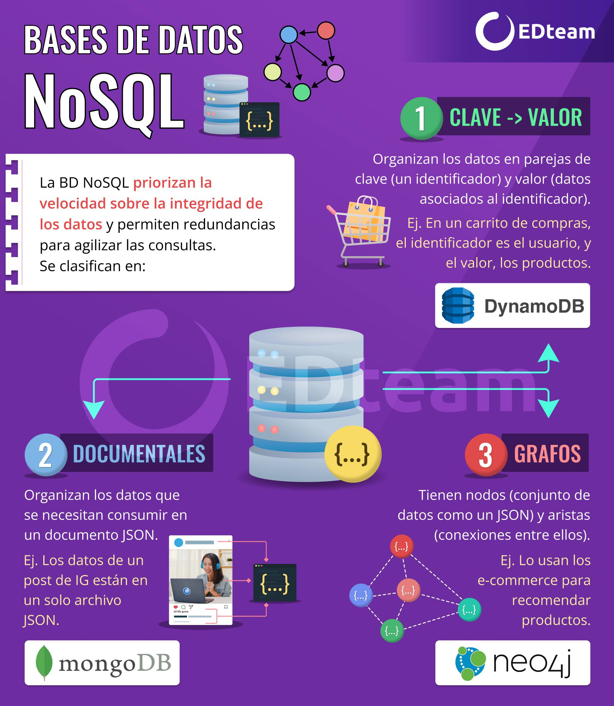
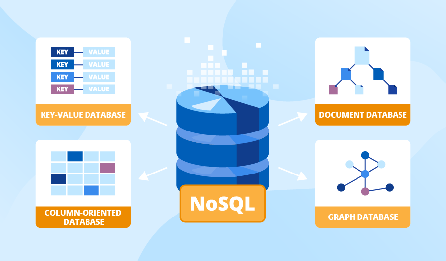
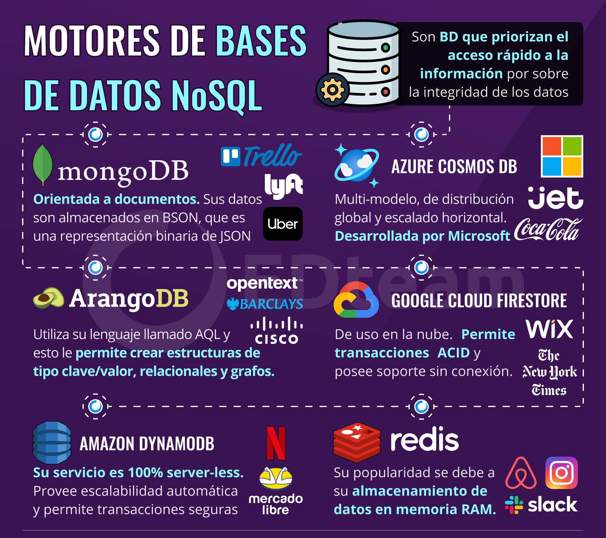

# Bases de datos no relacionales NoSQL

Las bases de datos no relacionales (o NoSQL) **no organizan sus datos en tablas**, no se preocupan de la normalización ni de las llaves foráneas. ¡O sea que la integridad de la información está en riesgo! Los datos se pueden repetir, y la estructura de la información pasa a un segundo plano. **La prioridad de las NoSQL es la velocidad**.

¿Te acuerdas el ejemplo de los cursos y los profesores que hicimos anteriormente? Las bases de datos NoSQL hacen exactamente lo que te dije que no había que hacer: juntan todos los datos en un solo lugar para acelerar las consultas.

{ width="60%" style="display:block; margin:auto;" }

Sus principales características son:

* **Posible Redundancia de datos**: mientras en SQL, un dato no puede repetirse, en NoSQL se permite la redundancia para que las consultas sean más veloces.
* **Velocidad** sobre integridad: las bases de datos NoSQL prefieren sacrificar la integridad de los datos para ganar velocidad.
* **No existe un lenguaje de consultas**: no existe un lenguaje estandarizado como SQL, sino que cada motor tiene sus propias definiciones y métodos en su API.

## Tipos de bases de datos NoSQL

Existen tres tipos de bases de datos NoSQL, según la forma en que organizan la información:

1. **Clave valor**: organizan los datos en parejas, como en un diccionario (palabra: definición). La clave es el identificador mientras que el valor es la información que se almacena. Este tipo de bases de datos se usan en gestión de sesiones o carritos de compras, donde la clave es un identificador único del usuario y en el valor se almacenan los productos o los datos de sesión. Un ejemplo es Dynamo DB de Amazon.
  
{ width="60%" style="display:block; margin:auto;" }

2. **Documentales**: almacenan la información en archivos JSON, llamados documentos. Puesto que JSON es un estándar, son muy fáciles de administrar, y la organización de la información es muy flexible. El motor más conocido es **MongoDB**.

{ width="60%" style="display:block; margin:auto;" }

3. **De grafos**: están basadas en la teoría matemática de grafos y organizan la información en nodos (vértices) que se relacionan entre sí (aristas). Cada nodo almacena información en formato clave valor mientras que las aristas representan las relaciones entre ellos. Se usan para sistemas de recomendación, conexiones entre amigos en redes sociales, anuncios o sistemas de rutas.

{ width="60%" style="display:block; margin:auto;" }

## Motores de bases de datos NoSQL

Al igual que las bases de datos relacionales, existen muchos motores de bases de datos no relacionales. Los más conocidos son MongoDB, Redis, Cassandra y DynamoDB.

En la siguiente infografía puedes ver más información sobre los motores de bases de datos NoSQL:

{ width="60%" style="display:block; margin:auto;" }

