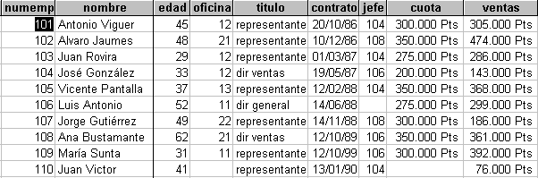
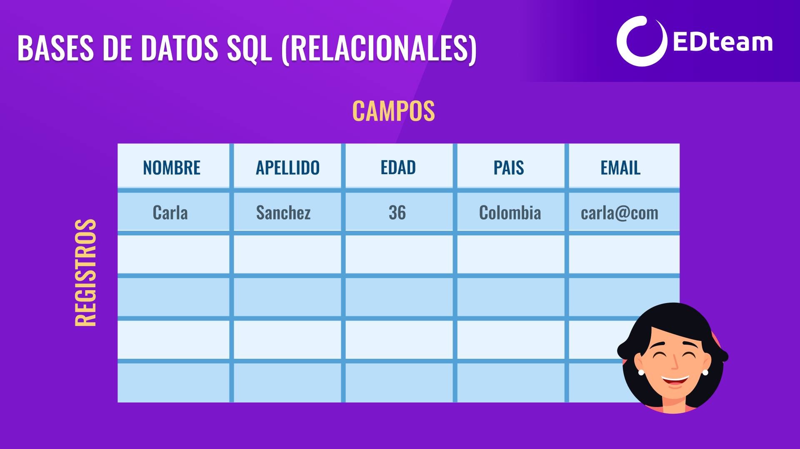
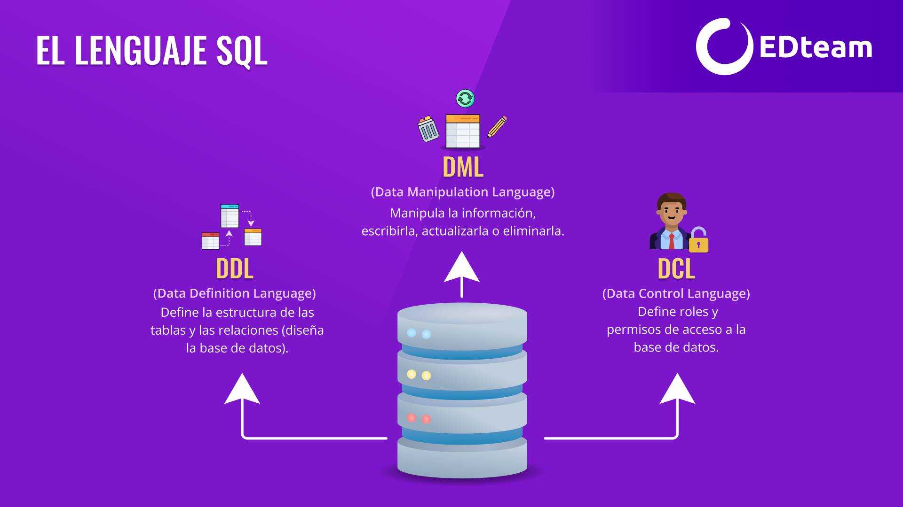
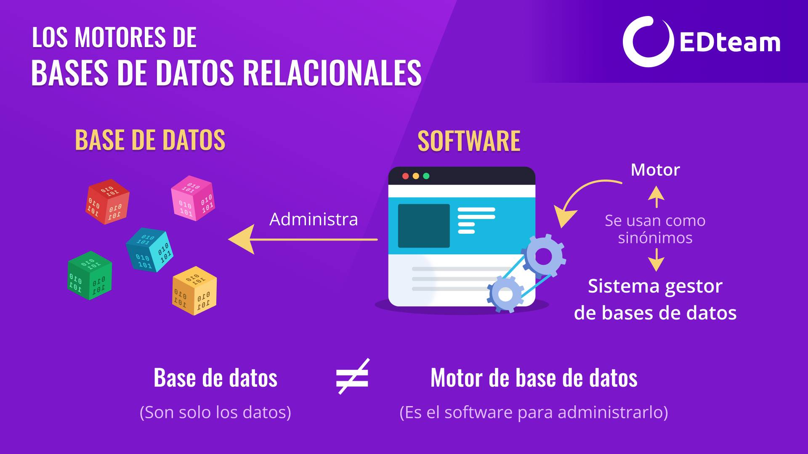

# Bases de datos relacionales SQL
  
Las bases de datos relacionales (SQL) organizan la información en **tablas**, como hojas de Excel, y cada tabla se usa para guardar un tipo específico de información para asegurar que no se repita.

{ width="80%" style="display:block; margin:auto;" }

Por ejemplo, imaginemos que vamos a registrar todos los **cursos en el instituto y los profesores que los dictan**. Podríamos hacer una lista de cursos y poner el profesor a cada lado y estaría resuelto. Pero hay un pequeño problema, si un profesor dicta más de un curso, tendríamos su nombre repetido en el listado.

Y se pone peor, imagina que cometimos un error al escribir el nombre del profesor, para corregirlo, habría que hacerlo en todos los lugares donde aparece y si nos equivocamos una sola vez, estropeamos todo. Ahora imagina que también queremos registrar los estudiantes de cada curso, puesto que un curso tiene varios estudiantes, y un estudiante puede tomar varios cursos, entonces ya tenemos un problema.

Esta es una tarea para las bases de datos SQL.

{ width="60%" style="display:block; margin:auto;" }

En las bases de datos relacionales (o SQL) se crea **una tabla separada para cada entidad** (las entidades son todo concepto que es independiente de los demás). En nuestro ejemplo, tendríamos *tres entidades*: cursos, profesores y estudiantes. Por lo tanto, crearemos tres tablas (una para cada entidad). Si queremos mostrar los cursos que dicta un profesor, la obtenemos creando una relación entre ambas tablas, lo mismo para obtener todos los estudiantes de un curso.

{ width="60%" style="display:block; margin:auto;" }

Gracias a esta forma de organizar los datos, evitamos que se repitan (redundancia) y garantizamos la integridad de los mismos. Es decir, no solo no tendremos más datos duplicados, sino que si se modifican, será visible en todos los lugares en que el dato aparezca. Este proceso se conoce como normalización de bases de datos.

Las *tablas* tienen **registros y campos**. Cada registro es un elemento nuevo de la entidad mientras que los campos son los atributos de esa entidad. Por ejemplo, la tabla profesores puede tener los **campos**: `Nombres, Apellidos, País, Correo electrónico` y cada vez que agregamos un nuevo registro (como un profesor nuevo), debemos llenar esos campos con la información correspondiente.

{ width="60%" style="display:block; margin:auto;" }

Las tablas tienen, además, **claves foráneas** (o Foreign Keys) que es un campo que permite **crear las relaciones entre distintas tablas** y restringir las operaciones entre los datos de ambas, por ejemplo, no borrar un usuario si tiene facturas. Las foreign keys son una de las características más importantes de las bases de datos SQL y como habrás notado, este modelo se preocupa mucho por la integridad de los datos.

## Origen del término SQL

En los años 70, Frank Codd propone el modelo relacional para organizar la información en tablas y relaciones. Luego, IBM crea el lenguaje SQL para administrar este tipo de base de datos. En sus inicios se iba a llamar SEQUEL (Structured English QUEry Language) pero por un problema de licencias con el nombre, se le quitaron las vocales y quedó como SQL (aunque se siguió pronunciando SEQUEL).

SQL es un lenguaje que se divide en tres lenguajes con funciones específicas:

* **DDL (Data Definition Language)**: se encarga de definir la estructura de las tablas y las relaciones (diseñar la base de datos).
* **DML (Data Manipulation Language)**: se encarga de manipular la información, escribirla, actualizarla o eliminarla.
* **DCL (Data Control Language)**: se encarga de definir roles y permisos de acceso a la base de datos.

{ width="60%" style="display:block; margin:auto;" }

## Motores de bases de datos relacionales

Por base de datos nos referimos solamente a los datos, mientras que el software, que se utiliza para gestionarlos, almacenarlos y consultarlos, es el Sistema Gestor de base de datos. El componente principal de este software es el motor, por lo que es usual hablar de Gestor de bases de datos y Motor de bases de datos como sinónimos.
 
{ width="60%" style="display:block; margin:auto;" }

Existen varios motores de bases de datos relacionales. Los más conocidos son:

* Oracle (1977): La empresa se lanza en 1977 con el nombre de Relational Sofware y crea el primer motor SQL comercial de la historia. Su creador, Larry Ellison, estuvo en el comité que definió la SQL.
* Microsoft SQL Server (1989): Es la respuesta de Microsoft a Oracle y, aunque funcionó siempre en Windows, es multiplataforma desde 2017. Son líderes en Business Intelligence (integrando más apps en el mismo paquete).
* **MySQL** (1995): Es el motor más usado en la web (y preferido por los CMS clásicos que usan PHP), tiene una curva de aprendizaje sencilla, por lo que se hizo muy famoso. Desde la compra por Oracle, tiene una versión Open Source y una versión privada.
* PostgreSQL (1996): Inició como un proyecto universitario llamado INGRES, inspirado en Oracle. Cumple el estándar ACID (que no cumple totalmente MySQL). Usan funciones y triggers que MySQL duró años en implementar.
* SQLite (2000): La base de datos está embebida en el programa, no usa la arquitectura cliente - servidor sino que guarda los datos en la misma aplicación. Al estar integrado en todos los teléfonos, se usa para almacenamiento interno de apps.
* MariaDB (2009): Es el Fork derivado de MySQL con licencia GPL, fue creado a partir de la compra de Sun por Oracle. Compatible con MySQL para poder cambiar un servidor por otro directamente.
