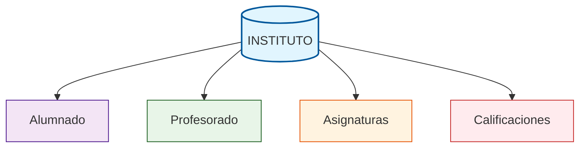
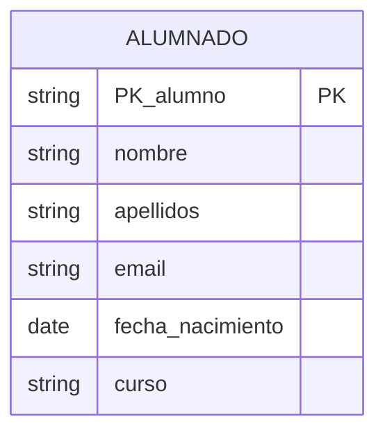
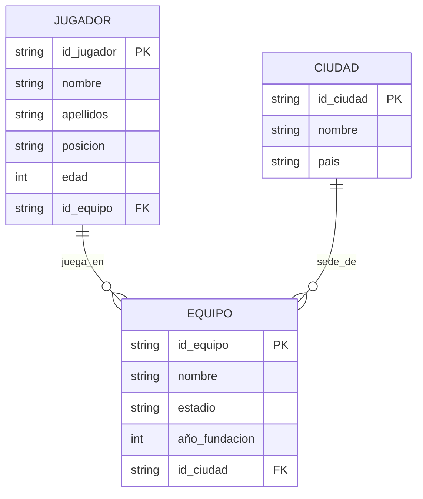
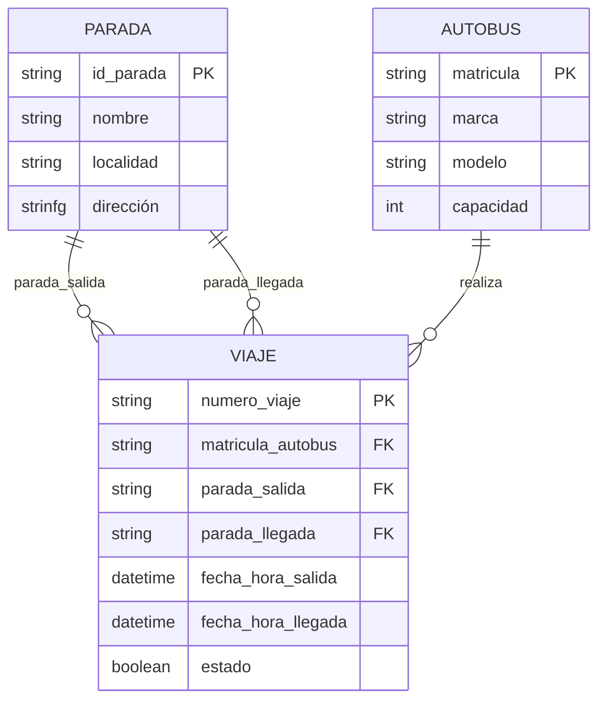
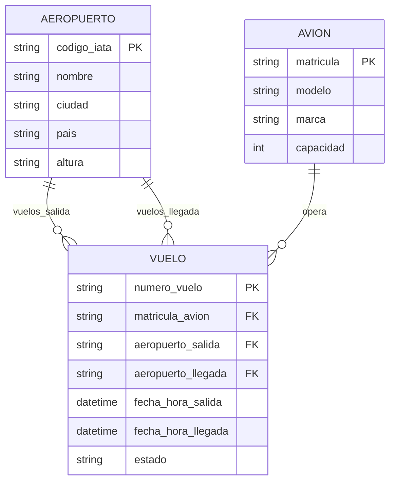

# Conceptos básicos de estructuras de bases de datos

Las bases de datos relacionales están organizadas de manera jerárquica y estructurada para facilitar el almacenamiento, la consulta y la gestión de grandes volúmenes de información.

{ width="60%" style="display:block; margin:auto;" }

## Base de Datos (o schema)

Es la **estructura principal** que contiene toda la información organizada. Una **base de datos o schema** puede **almacenar múltiples tablas** que están relacionadas entre sí. 

* **Ejemplo**: una **base de datos de un instituto** puede contener **tablas para alumnos, profesores, asignaturas y calificaciones**.

### Tabla

Representa una **entidad específica** dentro de la base de datos. Está compuesta por **filas y columnas** que estructuran la información de manera ordenada. Cada tabla debe tener un nombre único y almacenar datos relacionados con un tema concreto.

**Ejemplo:** La **tabla "Alumnado"**  contiene información sobre los estudiantes del centro.

| PK_alumno| nombre | apellidos | fecha_nacimiento | curso |
|:---:|--------|-----------|------------------|-------|
| AL01 | Ana | Pérez García | 2007-03-14 | 2ºBach |
| AL02 | Luis | Martín López | 2006-11-02 | 2ºBach |
| AL03 | Sofía | Rodríguez Díaz | 2007-07-21 | 1ºBach |
| AL04 | Marcos | Fernández Soto | 2006-01-30 | 2ºBach |

La forma de representar esta tabla es: *(por ahora fíjate en la columna del medio, las otras ls veremos más adelante)*

### Columna (Campo)

Define los atributos o **características que describen cada entidad**. Cada columna tiene un nombre específico y almacena un tipo particular de información.

* **Ejemplo:** En la tabla "Alumnos", las columnas podrían ser: ID, Nombre, Apellidos, Fecha_Nacimiento, Ciudad...

**| PK_alumno| nombre | apellidos | fecha_nacimiento | curso |**

### Fila (Registro)

Cada fila representa **una instancia individual de la entidad** almacenada en la tabla. Contiene toda la información específica de un elemento particular.

* **Ejemplo:** En la tabla "Alumnado", **cada fila correspondería a los datos personales de un estudiante**. Estos son los datos de Luis:

| AL02 | Luis | Martín López | 2006-11-02 | 2ºBach |

## Claves

Las claves son columnas (atributos) o conjuntos de columnas que permiten **identificar de forma única cada registro en una tabla**. Son fundamentales para mantener la integridad y consistencia de los datos.

### Clave Primaria (Primary key o PK)

!!! note Clave Primaria
  
    Es un campo (o conjunto de campos) que **identifica de forma única cada fila** de una tabla.
    
    **No puede repetirse ni estar vacío**, garantizando que cada registro sea distinguible del resto.

* **Ejemplo:** El **campo "PK_alumnado"** en la tabla "Alumnos" que contiene un número único para cada estudiante.

| PK_alumnado | nombre | apellidos | fecha_nacimiento | curso |
|:---:|--------|-----------|------------------|-------|
| AL1 | Ana | Pérez García | 2007-03-14 | 2ºBach |
| AL2 | Luis | Martín López | 2006-11-02 | 2ºBach |
|**AL3** | **Sofía** | **Rodríguez Díaz** | **2007-07-21** | **1ºBach** |
| AL4 | Marcos | Fernández Soto | 2006-01-30 | 2ºBach |
| **AL5** | **Sofía** | **Rodríguez Díaz** | **2007-07-21** | **1ºBach** |

## Clave Foránea (Foreign Key o FK)

!!! note Clave Foránea

    Campo que establece **una relación entre dos tablas diferentes**. Su valor debe coincidir con una clave primaria de otra tabla, creando vínculos entre las entidades.

**Ejemplo:** El campo "FK_curso" en la tabla "Alumnos" que hace referencia al "PK_curso" de la tabla "Cursos". Es decir, es una clave foránea que relaciona las dos tablas.

* Tabla: Alumnado

| PK_alummnado | nombre | apellidos | fecha_nacimiento | FK_curso |
|:---:|--------|-----------|------------------|-------|
| AL01 | Ana | Pérez García | 2007-03-14 | **CU06** |
| AL02 | Luis | Martín López | 2006-11-02 | **CU06** |
| AL03 | Sofía | Rodríguez Díaz | 2007-07-21 | **CU05** |
| AL04 | Marcos | Fernández Soto | 2006-01-30 | **CU06** |

* Tabla: Cursos

| PK_curso | Curso | Situación|
|:---:|--------|-----|
| **CU01** | 1ºESO |Zona A|
| **CU02** | 2ºESO | Zona A|
| **CU03** | 3ºESO | Zona A|
| **CU04** | 4ºESO | Zona B|
| **CU05** | 1ºBAC | Zona B|
| **CU06** | 2ºBAC |Zona B|

 > ¿En qué curso está Marcos Fernández Soto?

 > ¿En qué zona del instituto puedo encontara a Sofía?

## Relaciones entre tablas

Estos conceptos trabajan de forma conjunta para crear una estructura coherente:

- Una **base de datos** contiene múltiples **tablas**
- Cada **tabla** está formada por **filas** y **columnas**
- Las **claves primarias** aseguran la unicidad de cada **fila**
- Las **claves foráneas** conectan diferentes **tablas** entre sí

Esta organización permite mantener la integridad de los datos, evitar redundancias y facilitar las consultas complejas que involucren información de múltiples tablas.

Veamos un ejemplo:

🔗 **Resumen de Relaciones - Ejemplo Jugadores**

**EQUIPO - JUGADOR**
- **1 equipo** → **N jugadores** (`juega_en`)

**CIUDAD - EQUIPO**
- **1 ciudad** → **N equipos** (`sede_de`)

---

📋 **Claves Foráneas en JUGADOR**
- `id_equipo` → Equipo al que pertenece

📋 **Claves Foráneas en EQUIPO**
- `id_ciudad` → Ciudad donde juega

**Cada jugador tiene: 1 equipo**  
**Cada equipo tiene: 1 ciudad**

🔗 **Resumen de Relaciones**

**PARADA - VIAJE**
- 1 parada → N viajes de salida
- 1 parada → N viajes de llegada

**AUTOBUS - VIAJE**
- * autobús → N viajes realizados

---

📋 **Claves Foráneas en VIAJE**
- `parada_salida` → Parada de inicio
- `parada_llegada` → Parada de destino
- `matricula_autobus` → Autobús asignado

**Cada viaje tiene: 1 salida + 1 llegada + 1 autobús**

🔗 **Explicación de las Relaciones**

**1. AEROPUERTO → VUELO (vuelos_salida)**
- **Significado:** Un aeropuerto puede ser el **origen** de muchos vuelos
- **Ejemplo:** El aeropuerto MAD (Madrid) puede tener vuelos de salida a BCN, AGP, LIS, etc.

**2. AEROPUERTO → VUELO (vuelos_llegada)**
- **Significado:** Un aeropuerto puede ser el **destino** de muchos vuelos
- **Ejemplo:** El aeropuerto BCN (Barcelona) puede recibir vuelos desde MAD, AGP, VLC, etc.

**3. AVION → VUELO (opera)**
- **Significado:** Un avión puede realizar **muchos vuelos** a lo largo del tiempo
- **Ejemplo:** El avión EC-ABC puede operar el vuelo IB1234 hoy y el IB5678 mañana

---

📋 **Resumen de relaciones**

| Tabla | Relación | Tabla | Significado |
|-----------|----------|-----------|-------------|
| **AEROPUERTO** | 1:N | **VUELO** | 1 aeropuerto → Varios vuelos de salida |
| **AEROPUERTO** | 1:N | **VUELO** | 1 aeropuerto → Varios vuelos de llegada |
| **AVION** | 1:N | **VUELO** | 1 avión → Varios vuelos operados |

---

