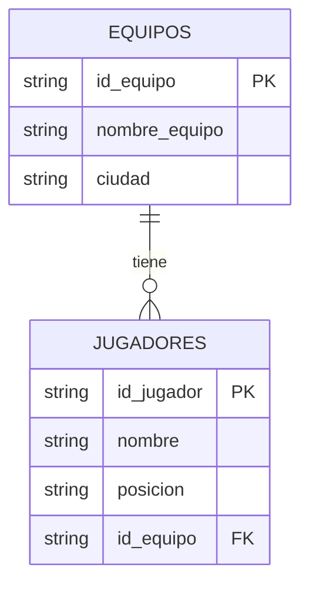

# Ejercicio: Normalización de Bases de Datos (Conceptos Básicos)

## 🔴 Tabla original (SIN normalizar)

Imagina que te presentan todos los jugadores de la liga de fútbol (en este caso trabajaremos con 10 registros) y te piden que la organices en las tablas normalizadas:

| nombre_jugador | posición       | nombre_equipo       | ciudad      |
|----------------|----------------|-------------------|-------------|
| Javier Pérez   | Delantero      | Club Deportivo Roma | Madrid      |
| Sergio Díaz    | Portero        | Atlético Sur        | Sevilla     |
| Marcos Ruiz    | Defensa        | Club Deportivo Roma | Madrid      |
| Luis Gómez     | Centrocampista | Unión Norte         | Valencia    |
| Pablo Torres   | Defensa        | Fútbol Club Este    | Barcelona   |
| Andrés León    | Delantero      | Atlético Sur        | Sevilla     |
| Diego Castro   | Centrocampista | Club Deportivo Roma | Madrid      |
| Raúl Ortega    | Portero        | Unión Norte         | Valencia    |
| Iván Morales   | Defensa        | Fútbol Club Este    | Barcelona   |
| Carlos Vega    | Delantero      | Club Deportivo Roma | Madrid      |

---

## ⚠️ Problemas de esta tabla (desnormalizada)

| Problema | Ejemplo | Impacto |
|----------|---------|--------|
| 🔁 **Redundancia de datos** | "Club Deportivo Roma" y "Madrid" se repiten 4 veces | Ocupa más espacio, difícil de mantener |
| ✏️ **Anomalías de actualización** | Si Atlético Sur se muda a Madrid, hay que cambiar 2 filas | Riesgo de inconsistencia |
| ➕ **Anomalías de inserción** | No se puede añadir un nuevo equipo sin jugadores | Información incompleta |
| ❌ **Anomalías de borrado** | Si borro a Sergio Díaz, pierdo info de Atlético Sur | Pérdida de datos |

---

## ✅ Tablas normalizadas (1ª, 2ª y 3ª Forma Normal)

### 📋 Tabla **EQUIPOS**

| id_equipo | nombre_equipo        | ciudad      |
|-----------|--------------------|-------------|
| EQ001     | Club Deportivo Roma | Madrid      |
| EQ002     | Atlético Sur        | Sevilla     |
| EQ003     | Unión Norte         | Valencia    |
| EQ004     | Fútbol Club Este    | Barcelona   |
| EQ005     | Real Montaña        | Bilbao      |

**Claves:**
- 🔑 **Clave Primaria (PK):** `id_equipo`

---

### 📋 Tabla **JUGADORES**

| id_jugador | nombre         | posición       | id_equipo |
|------------|----------------|----------------|-----------|
| JG001      | Javier Pérez   | Delantero      | EQ001     |
| JG002      | Sergio Díaz    | Portero        | EQ002     |
| JG003      | Marcos Ruiz    | Defensa        | EQ001     |
| JG004      | Luis Gómez     | Centrocampista | EQ003     |
| JG005      | Pablo Torres   | Defensa        | EQ004     |
| JG006      | Andrés León    | Delantero      | EQ002     |
| JG007      | Diego Castro   | Centrocampista | EQ001     |
| JG008      | Raúl Ortega    | Portero        | EQ003     |
| JG009      | Iván Morales   | Defensa        | EQ004     |
| JG010      | Carlos Vega    | Delantero      | EQ001     |

**Claves:**
- 🔑 **Clave Primaria (PK):** `id_jugador`
- 🔗 **Clave Foránea (FK):** `id_equipo` → referencia a `EQUIPOS.id_equipo`

---

## 🖼 Diagrama Entidad-Relación (ER)



**Explicación de la relación:**
- **1:N (uno a muchos)**: Un equipo tiene múltiples jugadores, pero cada jugador pertenece a un único equipo.
- `EQUIPOS.id_equipo` → `JUGADORES.id_equipo` (relación de integridad referencial)

---

## ✅ Ventajas de la normalización

| Ventaja | Explicación |
|---------|-------------|
| 📉 **Menos redundancia** | Los datos se almacenan una sola vez |
| ✏️ **Fácil actualización** | Un cambio en el equipo se refleja automáticamente en todos los jugadores |
| ➕ **Inserción flexible** | Se puede añadir un equipo nuevo sin necesidad de jugadores |
| 🔒 **Integridad referencial** | La BD garantiza que no haya jugadores sin equipo válido |
| ⚡ **Mejor rendimiento** | Menos datos duplicados = búsquedas más rápidas |

---

## 🎯 Preguntas de comprensión

### Nivel Básico (Identificación)

**1. ¿Cuál es la clave primaria (PK) en la tabla "JUGADORES"?**

- [ ] nombre
- [ ] id_jugador
- [ ] id_equipo

**2. ¿Cuál es la clave primaria (PK) en la tabla "EQUIPOS"?**

- [ ] ciudad
- [ ] nombre_equipo
- [ ] id_equipo

**3. ¿Qué campo en la tabla "JUGADORES" sirve como clave foránea (FK)?**

- [ ] nombre_equipo
- [ ] id_equipo
- [ ] posicion

**4. ¿En qué ciudad juega Sergio Díaz?** (Usa la tabla JUGADORES para buscar su `id_equipo`, luego consulta EQUIPOS)

- [ ] Madrid
- [ ] Sevilla
- [ ] Valencia

---

### Nivel Intermedio (Conceptos)

**5. Explica qué problemas tenía la tabla original (sin normalizar). Pon un ejemplo concreto.**

> Respuesta esperada: La redundancia (Club Deportivo Roma y Madrid se repiten), anomalías de actualización (si un equipo cambia de ciudad hay que actualizar múltiples filas), anomalías de inserción (no se puede registrar un equipo sin jugadores).

**6. ¿Cuál es la relación entre las tablas EQUIPOS y JUGADORES?**

- [ ] Uno a uno (1:1)
- [ ] Uno a muchos (1:N)
- [ ] Muchos a muchos (M:N)

Justifica tu respuesta: ___

**7. ¿Por qué no necesitamos una tabla intermedia de relación entre EQUIPOS y JUGADORES?**

> Respuesta esperada: Porque la relación es 1:N (uno a muchos). Un equipo puede tener varios jugadores, pero cada jugador pertenece a un solo equipo. Esto se representa con la FK en JUGADORES.

---

### Nivel Avanzado (Operaciones y Integridad)

**8. Intenta insertar un jugador nuevo con los datos:**
```
id_jugador: JG011
nombre: Fernando López
posición: Delantero
id_equipo: EQ999 (equipo que NO existe)
```

**¿Qué debería pasar? ¿Por qué?**

> Respuesta esperada: La BD debería rechazar la inserción con un error de integridad referencial (FK constraint violation), porque EQ999 no existe en la tabla EQUIPOS. Esto garantiza que no haya jugadores huérfanos sin equipo.

**9. ¿Se puede insertar un equipo nuevo sin jugadores?**

```sql
INSERT INTO EQUIPOS (id_equipo, nombre_equipo, ciudad)
VALUES ('EQ006', 'Sporting Costa', 'Málaga');
```

**¿Por qué sí se puede ahora?**

> Respuesta esperada: Sí, porque EQUIPOS es la tabla principal (lado "1" de la relación 1:N). La FK está en JUGADORES, no en EQUIPOS. Así, se pueden añadir equipos nuevos que posteriormente tendrán jugadores. En la tabla desnormalizada original, era imposible porque cada fila necesitaba un jugador.

**10. Elimina el jugador Sergio Díaz (JG002). ¿Qué sucede con los datos de Atlético Sur?**

> Respuesta esperada: El jugador se elimina, pero los datos de Atlético Sur (EQ002) se conservan en la tabla EQUIPOS. Ahora ese equipo no tiene jugadores, pero la información del equipo sigue disponible. En la tabla original, hubiera desaparecido toda la información de Atlético Sur.

---

## 💡 Conceptos clave

| Concepto | Definición |
|----------|-----------|
| **Clave Primaria (PK)** | Identificador único que distingue cada fila en una tabla. No puede ser NULL ni repetido. |
| **Clave Foránea (FK)** | Campo que referencia la PK de otra tabla. Establece relaciones entre tablas y garantiza integridad referencial. |
| **Normalización** | Proceso de reorganizar datos para eliminar redundancias y anomalías. |
| **Integridad Referencial** | Garantía de que toda FK apunta a un PK existente. |
| **Relación 1:N** | Un registro en la tabla principal se relaciona con múltiples registros en la tabla dependiente. |

---

## 📚 Formas Normales (resumen)

| Forma | Regla |
|-------|-------|
| **1ª Forma Normal (1FN)** | Eliminar grupos repetidos. Cada campo contiene un único valor (atómico). |
| **2ª Forma Normal (2FN)** | Cumplir 1FN + eliminar dependencias parciales. Todo atributo depende de toda la PK. |
| **3ª Forma Normal (3FN)** | Cumplir 2FN + eliminar dependencias transitivas. Ningún atributo depende de otros atributos. |

En nuestro ejercicio: EQUIPOS y JUGADORES cumplen las **tres formas normales**.

---

## 🔧 Retos adicionales (opcional)

**Reto 1:** Crea una consulta SQL para obtener el nombre y ciudad del equipo de cada jugador.

**Reto 2:** Si un equipo cambia de ciudad, ¿cuántas filas hay que actualizar? ¿Y en la tabla original?

**Reto 3:** Propón una estructura de tablas si los jugadores pueden jugar en múltiples equipos durante una temporada (relación M:N).

---

**Autor:** Material educativo para Tecnoloxía e Información (2º Bachillerato)  
**Versión:** 2.0 (Normalizada y mejorada)