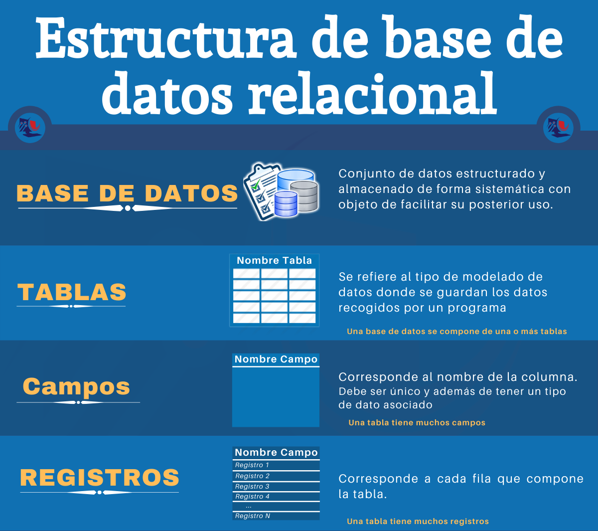
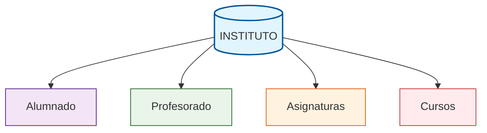
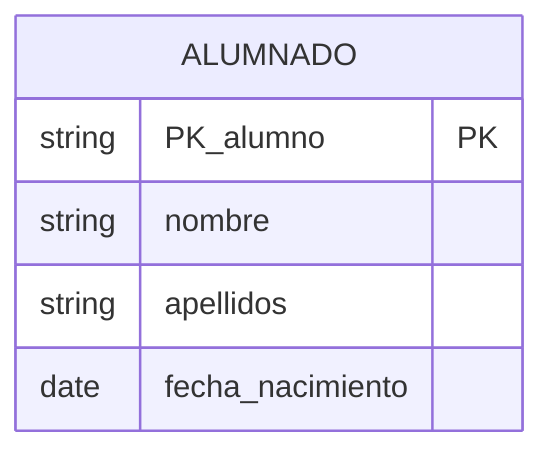
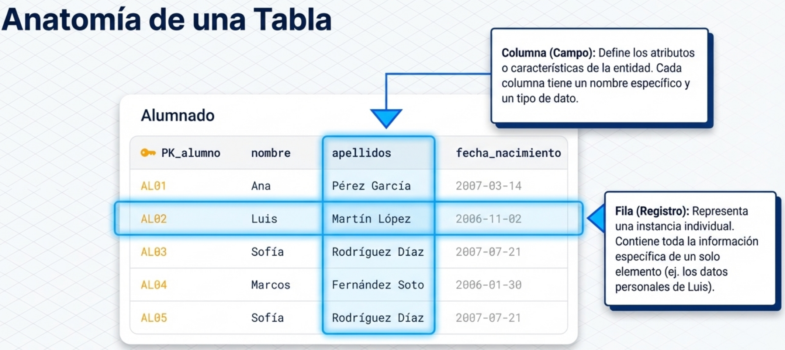
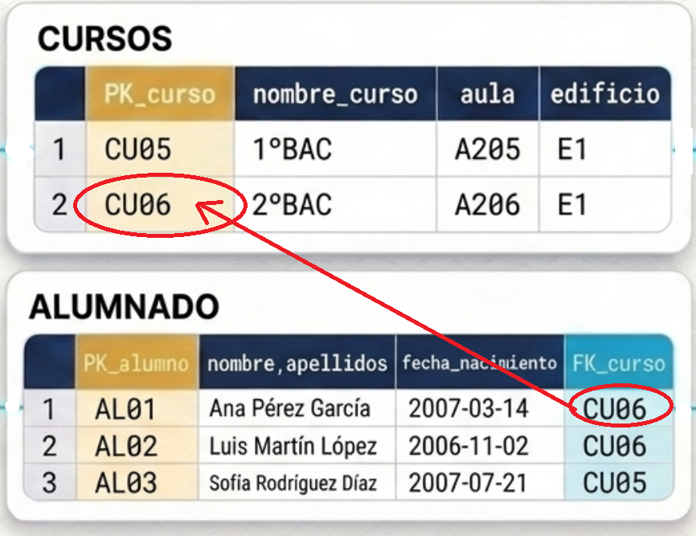
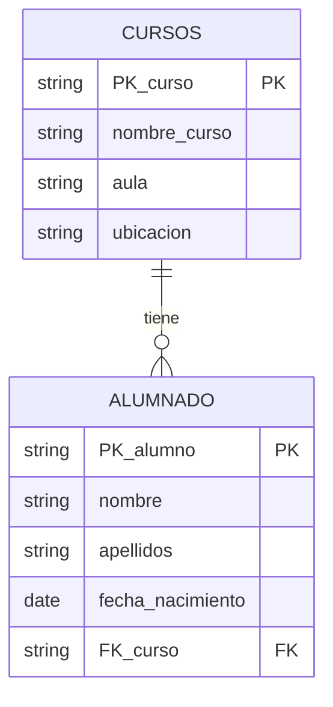
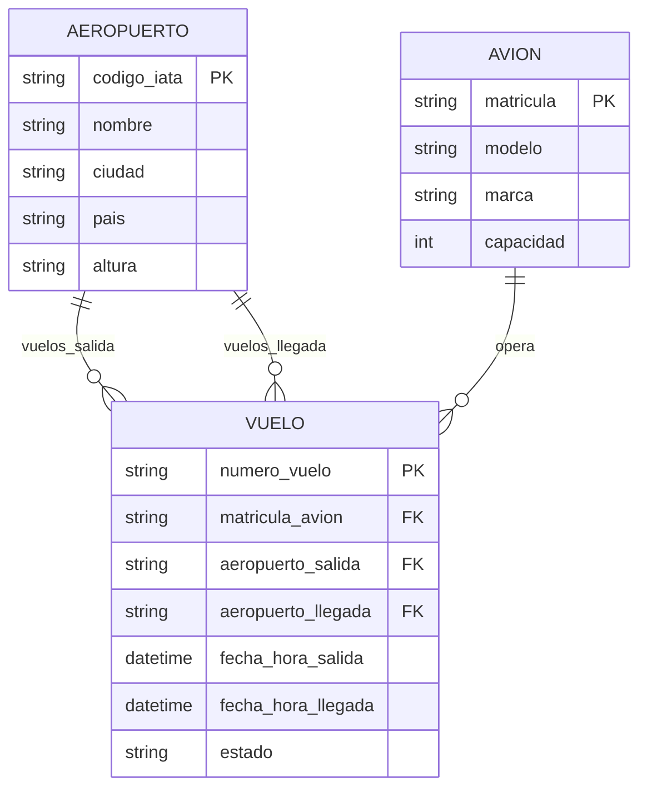

# Conceptos básicos de estructuras de bases de datos

Las bases de datos relacionales están organizadas de manera jerárquica y estructurada para facilitar el almacenamiento, la consulta y la gestión de grandes volúmenes de información.

{ width="80%" style="display:block; margin:auto;" }


## Base de Datos (o schema)

{ width="50%" align=right }


Es la **estructura principal** que contiene toda la información organizada. Una **base de datos o schema** puede **almacenar múltiples tablas** que están relacionadas entre sí. 

*Símil*: Es como una carpeta de Windows que contiene archivos.


* **Ejemplo**: una **base de datos de un instituto** puede contener **tablas para alumnos, profesores, asignaturas y cursos**.




### Tabla

Guarda características de una **entidad específica** dentro de la base de datos. Está compuesta por **filas y columnas** que estructuran la información de manera ordenada. Cada tabla debe tener un nombre único y almacenar datos relacionados con un tema concreto.

> ¿Qué es una **entidad específica**?

!!! note "Entidad"
    Una **entidad es cualquier cosa del mundo real sobre la que queremos guardar información**. Cada entidad tiene **características específicas** que la describen y la diferencian de otra.
    Ejemplos de entidades:

    * 🧑 ALUMNADO: Estudiantes del instituto. Características: nombre, apellidos, fecha de nacimiento  
    * 📚 CURSOS: Un grupo de estudiantes. Características: nombre del curso, aula, ubicación  
    * 👨‍🏫 PROFESORES: Un grupo de docentes. Características: nombre, especialidad, despacho  
    * 📖 ASIGNATURAS: Una serie de materias. Características: nombre, horas semanales, código  

**Ejemplo:** Tomemos de ejemplo la **tabla "Alumnado"**  que contiene información sobre (la entidad) estudiantes del centro.


| *PK_alumno*| nombre | apellidos | fecha_nacimiento |
|:---:|--------|-----------|------------------|
| *AL01* | Ana | Pérez García | 2007-03-14 |
| *AL02* | Luis | Martín López | 2006-11-02 |
| *AL03* | Sofía | Rodríguez Díaz | 2007-07-21 |
| *AL04* | Marcos | Fernández Soto | 2006-01-30 |
| *AL05* | Sofía | Rodríguez Díaz | 2007-07-21 |

La forma de representar esta tabla es: *(por ahora fíjate en la columna del medio, las otras las veremos más adelante)*



### Columna (Campo)

Define los atributos o **características que describen cada entidad**. Cada columna tiene un nombre específico (sin espacios) y almacena un tipo particular de información.

* **Ejemplo:** En la tabla "Alumnado", las columnas son: PK_alumno, nombre, apellidos, fecha_nacimiento...

    **| PK_alumno| nombre | apellidos | fecha_nacimiento |**

### Fila (Registro)

Cada fila representa **una instancia individual de la entidad** almacenada en la tabla. Contiene toda la información específica de un elemento particular.

* **Ejemplo:** En la tabla "Alumnado", **cada fila correspondería a los datos personales de un estudiante**. Estos son los datos de Luis:

    | AL02 | Luis | Martín López | 2006-11-02 |

{ width="100%"}

## Claves

Las claves son columnas (atributos) o conjuntos de columnas que permiten **identificar de forma única cada registro en una tabla**. Son fundamentales para mantener la integridad y consistencia de los datos.

> Convierten a los distintos registros/filas en únicos.

### Clave Primaria (Primary key o PK)

!!! note Clave Primaria
  
    Es un campo (o conjunto de campos) que **identifica de forma única cada fila** de una tabla.
    
    **No puede repetirse ni estar vacío**, garantizando que cada registro sea distinguible del resto.

* **Ejemplo:** El **campo "PK_alumno"** en la tabla "Alumnado" que contiene un código único para cada estudiante.

| PK_alumno | nombre | apellidos | fecha_nacimiento |
|:---:|--------|-----------|------------------|
| AL01 | Ana | Pérez García | 2007-03-14 |
| AL02 | Luis | Martín López | 2006-11-02 |
| **AL03** | **Sofía** | **Rodríguez Díaz** | **2007-07-21** |
| AL04 | Marcos | Fernández Soto | 2006-01-30 |
| **AL05** | **Sofía** | **Rodríguez Díaz** | **2007-07-21** |

❌ Como puedes observar en la tabla, existen dos alumnas que se llaman Sofía,  se apellidan igual y han nacido el mismo día. Pero son dos alumnas distintas.  
✅ **AL03** y **AL05** identifican de forma única a Sofía. A partir de ahora serán las alummnas *con nombres de robot*, **AL03** y **AL05**. 
---

### Clave Foránea (Foreign key o FK)


#### ⚠️ El Problema: ¿Dónde guardamos el Curso?

Hasta ahora, tenemos los datos básicos del alumnado. Pero la información está incompleta: **¿En qué curso está cada alumno?**

Tenemos dos opciones:

#### Opción 1️⃣: Meter el curso directamente en la tabla ALUMNADO ❌Error

Añadimos una columna `curso` a la tabla:

| PK_alumno | nombre | apellidos | fecha_nacimiento | curso | aula | ubicacion |
|:---:|--------|-----------|------------------|-------|-------------|-----------|
| AL01 | Ana | Pérez García | 2007-03-14 | 2ºBach |A206 | Edificio C |
| AL02 | Luis | Martín López | 2006-11-02 | 2ºBach | A206 | Edificio C |
| AL03 | Sofía | Rodríguez Díaz | 2007-07-21 | 1ºBach |A106 | Edificio C |
| AL04 | Marcos | Fernández Soto | 2006-01-30 | 2ºBach | A206 | Edificio C |
| AL05 | Sofía | Rodríguez Díaz | 2007-07-21 | 1ºBach | A105 | Edificio C |

**¿Ventajas?**  

- ✅ Simple y rápido    
- ✅ Toda la información en una tabla  

**¿Problemas?**  

- ❌ Si escribimos mal "2ºBach" en una fila y "2º Bach" en otra, tenemos inconsistencia  
- ❌ ¿Qué pasa si queremos saber más datos del curso (aula, ubicación, horario)?  
- ❌ No podemos registrar un curso nuevo si no tiene alumnos  
- ❌ Si eliminas todos los alumnos de un curso, pierdes la información del curso  

---

#### Opción 2️⃣: Crear una tabla CURSOS separada y relacionarla ✅Acierto

En lugar de guardar el nombre del curso, guardamos un **identificador único** del curso:

**Tabla: CURSOS**

| **PK_curso** | nombre_curso | aula | ubicacion |
|:---:|--------|-------------|-----------|
| CU01 | 1ºESO | A105 | Edificio A |
| CU02 | 2ºESO | A107 | Edificio A |
| CU03 | 3ºESO | A106 | Edificio B |
| CU04 | 4ºESO | A104 | Edificio B |
| CU05 | 1ºBAC | A205 | Edificio C |
| CU06 | 2ºBAC | A206 | Edificio C |

**Tabla: ALUMNADO** (con clave foránea)

| PK_alumno | nombre | apellidos | fecha_nacimiento | **FK_curso** |
|:---:|--------|-----------|------------------|----------|
| AL01 | Ana | Pérez García | 2007-03-14 | CU06 |
| AL02 | Luis | Martín López | 2006-11-02 | CU06 |
| AL03 | Sofía | Rodríguez Díaz | 2007-07-21 | CU05 |
| AL04 | Marcos | Fernández Soto | 2006-01-30 | CU06 |
| AL05 | Sofía | Rodríguez Díaz | 2007-07-21 | CU05 |

**¿Ventajas?**

- ✅ Datos consistentes (no hay duplicados del curso)  
- ✅ Datos centralizados (cambios en el curso se reflejan automáticamente)  
- ✅ Podemos guardar cursos sin alumnos aún  
- ✅ Mejor organización de la información  

**¿Desventajas?**

- ⚠️ Necesitamos dos tablas en lugar de una.  
- ⚠️ Consultas un poco más complejas (necesitamos relacionar tablas).  

---

### ✅ La Solución: la Opción 2 (Claves Foráneas)

La **Opción 2** es mucho mejor. Para ello usamos la **Clave Foránea (FK)**.

#### Clave Foránea (Foreign Key o FK)

{ width="30%" align=right}

!!! Clave_Foránea

    Campo que establece **una relación entre dos tablas diferentes**. *Su valor debe coincidir con una clave primaria de otra tabla*, creando vínculos entre las entidades.
    
    Una clave foránea es un **enlace a la clave primaria de otra tabla**.

En este ejemplo, **el campo "FK_curso" en la tabla "ALUMNADO" es el campo FK,  que hace referencia al campo PK "PK_curso" de la tabla "CURSOS"**.


## 🔗 Diagrama de relación. Relaciones entre tablas

Observa las flechas que conectan las tablas:



**Explicación:**  
- **1 curso** → **Muchos alumnos** (`||--o{`)  
    - Un curso puede tener múltiples alumnos  
- Pero cada alumno pertenece a **un único curso**  

> La relación se llama **1:N (uno a muchos)**  

---

## 💡 ¿Por qué esto es mejor?

### Preguntas frecuentes:

> **¿En qué curso está Sofía?**

Busco a Sofía (AL03) en ALUMNADO → FK_curso = **CU05**  
Busco CU05 en CURSOS → **1ºBAC**

> **¿Cuál es el aula del curso de Marcos?**

Busco a Marcos (AL04) en ALUMNADO → FK_curso = **CU06**  
Busco CU06 en CURSOS → aula = **A205**

> **¿Qué pasa si cambio el aula de 2ºBAC de A205 a A300?**

Solo modifico **una fila** en la tabla CURSOS. Automáticamente, **todos los alumnos de CU06 verán el cambio**.

Con la Opción 1 (curso directamente en ALUMNADO), tendría que cambiar **3 filas** (Ana, Luis y Marcos).

---

## 🔒 Integridad Referencial

La base de datos garantiza automáticamente que:

✅ Todo FK_curso en ALUMNADO apunta a un PK_curso que existe en CURSOS

❌ No puedo insertar un alumno con FK_curso = "CU999" si CU999 no existe

```
❌ ERROR: No se puede insertar
INSERT INTO ALUMNADO (PK_alumno, nombre, apellidos, fecha_nacimiento, FK_curso)
VALUES ('AL05', 'Juan', 'García López', '2007-05-10', 'CU999');
-- CU999 no existe en CURSOS, por lo que la BD rechaza la inserción
```

✅ CORRECTO: El curso debe existir

```sql
✅ OK: Se inserta correctamente
INSERT INTO ALUMNADO (PK_alumno, nombre, apellidos, fecha_nacimiento, FK_curso)
VALUES ('AL05', 'Juan', 'García López', '2007-05-10', 'CU06');
-- CU06 existe en CURSOS, la inserción es válida
```

---


## 🛫 Otro Ejemplo más complejo: Vuelos aéreos

{ width="60%" style="display:block; margin:auto;" }




🔗 **Explicación de las Relaciones**

**1. AEROPUERTO → VUELO (vuelos_salida)**
- **Significado:** Un aeropuerto puede ser el **origen** de muchos vuelos
- **Ejemplo:** MAD (Madrid) puede tener vuelos de salida a BCN, AGP, LIS, etc.

**2. AEROPUERTO → VUELO (vuelos_llegada)**
- **Significado:** Un aeropuerto puede ser el **destino** de muchos vuelos
- **Ejemplo:** BCN (Barcelona) puede recibir vuelos desde MAD, AGP, VLC, etc.

**3. AVION → VUELO (opera)**
- **Significado:** Un avión puede realizar **muchos vuelos** a lo largo del tiempo
- **Ejemplo:** El avión EC-ABC puede operar el vuelo IB1234 hoy y el IB5678 mañana

---

📋 **Resumen de relaciones**

| Tabla | Relación | Tabla | Significado |
|-----------|----------|-----------|-------------|
| **AEROPUERTO** | 1:N | **VUELO** | 1 aeropuerto → Varios vuelos de salida |
| **AEROPUERTO** | 1:N | **VUELO** | 1 aeropuerto → Varios vuelos de llegada |
| **AVION** | 1:N | **VUELO** | 1 avión → Varios vuelos operados |

---

## 💡 Conceptos Clave

| Concepto | Definición |
|----------|-----------|
| **Clave Primaria (PK)** | Identificador único que distingue cada fila en una tabla. No puede ser NULL ni repetido. |
| **Clave Foránea (FK)** | Campo que referencia la PK de otra tabla. Establece relaciones entre tablas y garantiza integridad referencial. |
| **Relación 1:N** | Un registro en la tabla principal se relaciona con múltiples registros en la tabla dependiente. |
| **Integridad Referencial** | Garantía de que toda FK apunta a un PK existente. |
| **Normalización** | Proceso de reorganizar datos para eliminar redundancias y anomalías. |

---
