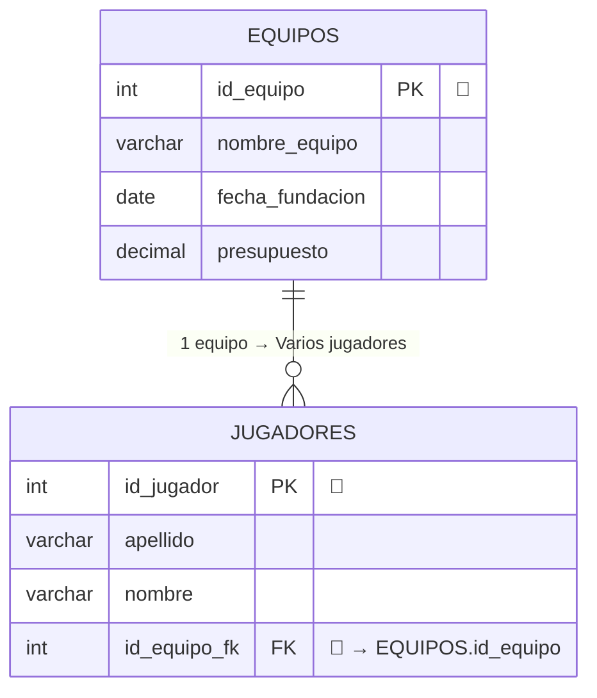
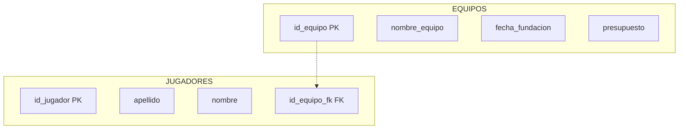

# Comandos DDL (Data Definition Language)

Los comandos DDL se utilizan para **definir** y **modificar** la estructura de la base de datos: bases de datos, tablas, índices y restricciones. A continuación se describen los principales:

* `CREATE DATABASE`
* `USE DATABASE`
* `CREATE TABLE`

***

## `CREATE DATABASE`  

El comando `CREATE DATABASE` se utiliza para **crear una nueva base de datos** en el servidor:

```sql
CREATE DATABASE nombre_base_de_datos;
```

**Función:** Crea un espacio nuevo y vacío donde posteriormente se podrán almacenar tablas y datos.

**Ejemplo:**

```sql
CREATE DATABASE instituto;
```

Con este comando se crea una base de datos llamada "instituto" en el servidor.

***


## `USE`

El comando `USE` permite seleccionar y activar una base de datos para trabajar con ella:

```sql
USE nombre_base_de_datos;
```

**Función:** Establece cuál es la base de datos activa para las siguientes operaciones (crear tablas, insertar datos, etc.).

**Ejemplo:**
```sql
USE instituto;
```

**Secuencia típica:**
1. Primero se crea la base de datos con `CREATE DATABASE`
2. Después se selecciona con `USE` para comenzar a trabajar dentro de ella
3. A continuación ya se pueden crear tablas y realizar otras operaciones

```sql
CREATE DATABASE instituto;
USE instituto;
-- Ahora ya puedes crear tablas dentro de "instituto"
```

***

## `CREATE TABLE`

El comando `CREATE TABLE` es fundamental en DDL porque define la **estructura completa de una tabla nueva**, especificando cada columna, sus tipos de datos y todas las restricciones aplicables.

```sql
CREATE TABLE nombre_tabla (
    nombre_columna1 tipo_dato restricciones,
    nombre_columna2 tipo_dato restricciones
    );
```
Depués del nombre de la columna hay que indicar qué **tipo de contenido** va a guardar y una o varias **restricciones**.

### Tipos de datos más comunes en SQL

| Tipo de dato | Descripción | Ejemplo |
|--------------|-------------|---------|
| `INT` | Número entero | `edad INT` |
| `VARCHAR(n)` | Cadena de texto variable hasta n caracteres | `nombre VARCHAR(50)` |
| `DATE` | Fecha en formato YYYY-MM-DD | `fecha_nacimiento DATE` |
| `DECIMAL(p,s)` | Número decimal con p dígitos totales y s decimales | `precio DECIMAL(10,2)` |
| `BOOLEAN` | Valores Sí/No Verdadero/Falso | `pedido_enviado BOOLEAN` |

### Restricciones principales

- **`PRIMARY KEY`:** Define la clave primaria que identifica únicamente cada fila.
- **`AUTO_INCREMENT`:** Genera automáticamente valores secuenciales únicos, ideal para IDs.
- **`NOT NULL`:** Obliga a que el campo tenga un valor (no puede estar vacío).
- **`UNIQUE`:** Garantiza que no se repitan valores en esa columna.
  - La columna que hace de Primary Key no va a permitir nunca valores repetidos, por lo que a esa columna no hace falta asignarle esta restricción.
- **`DEFAULT`:** Establece un valor por defecto si no se especifica otro.

### Ejemplo práctico completo
```sql
CREATE TABLE Equipos (
    id_equipo INT AUTO_INCREMENT PRIMARY KEY,
    nombre_equipo VARCHAR(50) NOT NULL,
    ciudad VARCHAR(30) DEFAULT 'Madrid',
    fecha_fundacion DATE,
    presupuesto DECIMAL(15,2)
);
```

En este ejemplo:
- `id_equipo` se incrementa automáticamente y es la clave primaria
- `nombre_equipo` es obligatorio (NOT NULL)
- `ciudad` tiene un valor por defecto si no se especifica
- `fecha_fundacion` y `presupuesto` son opcionales

!!! note Diagrama ER

    Un Diagrama Entidad-Relación (ER) es una representación gráfica que muestra la estructura de una base de datos. Es como el "plano" o "mapa" de cómo se organizan los datos.
    Aquí se representa la estructura de la tabla creada.

    ```mermaid
    erDiagram
        EQUIPOS {
            int id_equipo PK "AUTO_INCREMENT"
            varchar(50) nombre_equipo "NOT_NULL"
            varchar(30) ciudad  "Madrid"
            date fecha_fundacion
            decimal presupuesto "(15, 2)"
        }
    ```


Esta estructura asegura la integridad y organización de los datos desde el momento de la creación de la tabla.

Aquí tienes cómo sería una tabla de salida siguiendo la estructura diseñada en tu instrucción SQL. Puedes imaginar que se han insertado algunos equipos como ejemplo:

| id_equipo | nombre_equipo   | ciudad      | fecha_fundacion | presupuesto   |
|-----------|-----------------|-------------|-----------------|--------------|
| 1         | Tigres Madrid   | Madrid      | 2005-06-13      | 1200000.00   |
| 2         | Leones Sevilla  | Sevilla     | 2008-03-21      | 800000.00    |
| 3         | Águilas Valencia| Valencia    | 2012-09-30      | 950000.50    |
| 4         | Halcones Madrid | Madrid      | 2010-10-10      | 1505000.00   |


## `ALTER TABLE`  

Modifica la estructura de una tabla existente:

- Añadir columna:  
  ```sql
  ALTER TABLE Equipos
    ADD estadio VARCHAR(50);
  ```
    ```mermaid
    erDiagram
        EQUIPOS {
            int id_equipo PK "AUTO_INCREMENT"
            varchar(50) nombre_equipo "NOT_NULL"
            varchar(30) ciudad  "Madrid"
            date fecha_fundacion
            decimal presupuesto "(15, 2)"
            varchar(50) estadio
        }
    ```


- Eliminar columna:  
  ```sql
  ALTER TABLE Equipos
    DROP COLUMN ciudad;
  ```
    ```mermaid
    erDiagram
        EQUIPOS {
            int id_equipo PK "AUTO_INCREMENT"
            varchar(50) nombre_equipo "NOT_NULL"
            date fecha_fundacion
            decimal presupuesto "(15, 2)"
        }
    ```

- Añadir restricción (por ejemplo, clave foránea):  
  ```sql
  ALTER TABLE Jugadores
    ADD CONSTRAINT fk_equipo
    FOREIGN KEY (id_equipo)
    REFERENCES Equipos(id_equipo);
  ```
Imagina que tenemos una tabla `JUGADORES`:

  ```mermaid
  erDiagram
      JUGADORES {
          int id_jugador PK "AUTO_INCREMENT"
          varchar(50) apellido "NOT_NULL"
          varchar(30) nombre "NOT_NULL"
      }
 
 ```
 
y queremos relacionarla con la tabla EQUIPOS. Para ello debemos amodificar la tabla `JUGADORES` creando un campo FOREIGN KEY nuevo (`ìd_equipo_fk`) que hará de conexión con la tabla `EQUIPOS`, a través de su PRIMARY KEY `id_equipo`.

  ```mermaid
  erDiagram
      JUGADORES {
          int id_jugador PK "AUTO_INCREMENT"
          varchar(50) apellido "NOT_NULL"
          varchar(30) nombre "NOT_NULL"
          int id_equipo_fk FK "Equipos: id_equipos"
      }
  ```

Las tablas `EQUIPOS` y `JUGADORES` están conectadas por las campos PK de `EQUIPOS` (id_equipo) y el campo FK de `JUGADORES` (id_equipo_fk).


Así puede ser que se entienda mejor:




***

## `DROP`

Elimina objetos de la base de datos:

- Borrar tabla:  
  ```sql
  DROP TABLE Jugadores;
  ```
- Borrar base de datos:  
  ```sql
  DROP DATABASE instituto;
  ```

***

Estos comandos DDL son la base para construir y mantener la **estructura** de una base de datos relacional antes de almacenar o consultar datos.