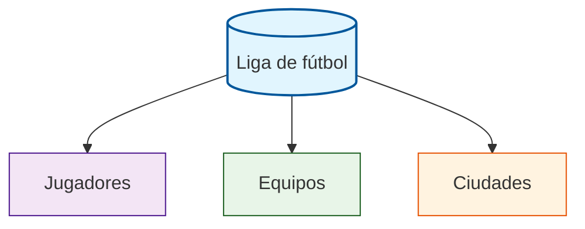

# Actividad:## Diseña la base de datos de la Liga de Fútbol*

---

## 🎯 **Objetivo de la actividad**  

La Liga de Fútbol nos ha encargado crear una base de datos relacional para lo que nos ha dado una lista en la que se encuentran datos mezclados.


### 📊 Lista dada por la Liga


| Jugador | Equipo | Ciudad | País | Posición | Edad | Año Fundación | Estadio | Capacidad |
|---------|---------|---------|-------|-----------|------|---------------|---------|-----------|
| Karim Benzema | Real Madrid | Madrid | España | Delantero | 36 | 1902 | Santiago Bernabéu | 81.044 |
| Lionel Messi | Inter Miami | Miami | Estados Unidos | Delantero | 36 | 2018 | DRV PNK Stadium | 18.000 |
| Cristiano Ronaldo | Al Nassr | Riad | Arabia Saudita | Delantero | 39 | 1955 | Mrsool Park | 25.000 |
| Kevin De Bruyne | Manchester City | Manchester | Inglaterra | Centrocampista | 32 | 1880 | Etihad Stadium | 53.400 |
| Robert Lewandowski | FC Barcelona | Barcelona | España | Delantero | 35 | 1899 | Spotify Camp Nou | 99.354 |
| Kylian Mbappé | Paris Saint-Germain | París | Francia | Delantero | 25 | 1970 | Parc des Princes | 48.583 |
| Erling Haaland | Manchester City | Manchester | Inglaterra | Delantero | 23 | 1880 | Etihad Stadium | 53.400 |
| Vinicius Junior | Real Madrid | Madrid | España | Extremo | 23 | 1902 | Santiago Bernabéu | 81.044 |
| Harry Kane | Bayern Munich | Múnich | Alemania | Delantero | 30 | 1900 | Allianz Arena | 75.000 |
| Mohamed Salah | Liverpool | Liverpool | Inglaterra | Delantero | 31 | 1892 | Anfield | 53.394 |
| Luka Modrić | Real Madrid | Madrid | España | Centrocampista | 38 | 1902 | Santiago Bernabéu | 81.044 |
| Jude Bellingham | Real Madrid | Madrid | España | Centrocampista | 20 | 1902 | Santiago Bernabéu | 81.044 |
| Rodri | Manchester City | Manchester | Inglaterra | Centrocampista | 27 | 1880 | Etihad Stadium | 53.400 |
| Virgil van Dijk | Liverpool | Liverpool | Inglaterra | Defensa | 32 | 1892 | Anfield | 53.394 |
| Pedri | FC Barcelona | Barcelona | España | Centrocampista | 21 | 1899 | Spotify Camp Nou | 99.354 |
| Manuel Neuer | Bayern Munich | Múnich | Alemania | Portero | 37 | 1900 | Allianz Arena | 75.000 |
| Thibaut Courtois | Real Madrid | Madrid | España | Portero | 31 | 1902 | Santiago Bernabéu | 81.044 |
| Trent Alexander-Arnold | Liverpool | Liverpool | Inglaterra | Defensa | 25 | 1892 | Anfield | 53.394 |
| İlkay Gündoğan | FC Barcelona | Barcelona | España | Centrocampista | 33 | 1899 | Spotify Camp Nou | 99.354 |
| Neymar Jr | Al Hilal | Riad | Arabia Saudita | Delantero | 31 | 1957 | Prince Faisal bin Fahd | 22.500 |

---
## Paso 1: Análisis de la tabla actual

Después de observar la tabla podemos observar los siguientes errores:

❌ Datos duplicados en una misma columna (Equipos, Ciudades, Estadios repetidos)

❌ Dependencias transitivas (Estadio depende de Equipo, no de Jugador)
❌ Actualizaciones complejas (Cambiar estadio requiere modificar múltiples filas)

## Paso 2: Normalización de la Base de Datos

El primer paso para su solución es separar en tablas normalizadas,  aplicando los conceptos de **entidades y relaciones**.





## 🎯 **Ejercicios para Alumnos con Datos Completos**

### **Parte 1: Análisis de Estadios**
1. ¿Qué estadio tiene mayor capacidad?
2. ¿Cuántos equipos comparten estadio en la misma ciudad?
3. ¿Cuál es la capacidad promedio de los estadios?

### **Parte 2: Consultas SQL Avanzadas**
```sql
-- Jugadores que juegan en estadios con capacidad > 50.000
SELECT jugador, equipo, estadio, capacidad
FROM tabla_jugadores 
WHERE capacidad > 50000;

-- Equipos fundados antes de 1900
SELECT equipo, año_fundación, ciudad
FROM tabla_jugadores
WHERE año_fundación < 1900
GROUP BY equipo, año_fundación, ciudad;
```

### **Parte 3: Preguntas de Reflexión**
1. ¿Por qué varios jugadores tienen el mismo estadio?
2. ¿Qué relación existe entre Equipo y Estadio?
3. ¿Cómo modelarías esta relación en el diagrama ER?

---

## 📝 **Datos Curiosos para Análisis**

### **Estadios más Grandes:**
- 🏟️ **Spotify Camp Nou** (99.354) - FC Barcelona
- 🏟️ **Santiago Bernabéu** (81.044) - Real Madrid  
- 🏟️ **Allianz Arena** (75.000) - Bayern Munich

### **Equipos con Mismo Estadio:**
- **Manchester City** → Etihad Stadium
- **Real Madrid** → Santiago Bernabéu (4 jugadores)
- **Liverpool** → Anfield (3 jugadores)

### **Equipos Más Antiguos:**
- 🏛️ **Manchester City** (1880)
- 🏛️ **Liverpool** (1892) 
- 🏛️ **FC Barcelona** (1899)

---

## 🔍 **Ejercicio de Normalización**

**Problema:** Identifica qué atributos deberían estar en tablas separadas según el diagrama ER original.

**Solución Propuesta:**
- Tabla CIUDAD: (id_ciudad, nombre, pais)
- Tabla EQUIPO: (id_equipo, nombre, estadio, capacidad, año_fundación, id_ciudad)
- Tabla JUGADOR: (id_jugador, nombre, posicion, edad, id_equipo)

**¡Base de datos completa para trabajar!** ⚽📊


## 🔍 **Análisis del Diagrama**

### **Entidades (tablas) Identificadas:**
- **JUGADOR**: Información de cada futbolista
- **EQUIPO**: Datos de los equipos de fútbol  
- **CIUDAD**: Localizaciones de los equipos

### **Relaciones:**
- **JUGADOR → EQUIPO**: `juega_en` (1:N)
- **CIUDAD → EQUIPO**: `sede_de` (1:N)

---

## 💻 **Ejercicio Práctico**

### **Parte 1: Comprender las Relaciones**
1. ¿Cuántos jugadores puede tener un equipo?
2. ¿Puede un jugador pertenecer a varios equipos simultáneamente?
3. ¿Puede una ciudad ser sede de múltiples equipos?

### **Parte 2: Diseñar Datos de Ejemplo**
Completa esta tabla con datos inventados:

| Jugador | Equipo | Ciudad | País |
|---------|---------|---------|-------|
| | Real Madrid | Madrid | España |
| Lionel Messi | | Barcelona | |
| | Manchester United | | Inglaterra |

### **Parte 3: Identificar Claves**
- ¿Cuál sería la **clave primaria** de la tabla JUGADOR?
- ¿Qué campo actúa como **clave foránea** en EQUIPO?
- ¿Por qué `id_equipo` es FK en JUGADOR?

---

## 🛠️ **Ejercicio de Implementación**

### **Crea las tablas SQL:**
```sql
-- Completa los tipos de datos y restricciones
CREATE TABLE CIUDAD (
    id_ciudad _____ _____ KEY,
    nombre _______,
    pais _______
);

CREATE TABLE EQUIPO (
    _____ _____ PRIMARY KEY,
    nombre _______,
    estadio _______,
    año_fundacion _______,
    _____ _______ REFERENCES _______(_______)
);
```

---

## 📝 **Preguntas de Reflexión**

1. ¿Qué ocurriría si un jugador cambia de equipo?
2. ¿Cómo manejaríamos equipos que se mudan de ciudad?
3. ¿Falta alguna entidad importante en el modelo?

---

## 🎓 **Conceptos Aplicados**
- ✅ Entidades y Atributos
- ✅ Relaciones 1:N
- ✅ Claves Primarias y Foráneas
- ✅ Cardinalidades
- ✅ Normalización básica

**¡Ahora diseña tu propia liga de fútbol!** ⚽