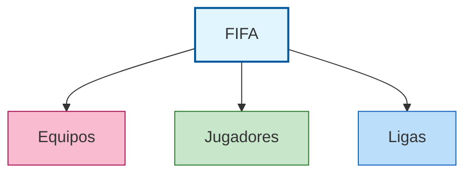
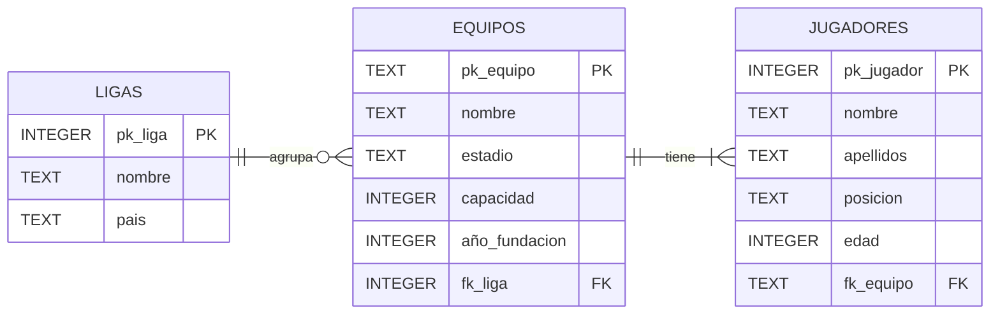

# Actividad: 
## Diseña la base de datos de la FIFA (Federación Internacional de Fútbol Asociación)
### 📝 Versión para completar

> Rellena todos los huecos `______` antes de ejecutar el código en DB Browser. Si el código está incompleto, SQLite devolverá un error.

***

## 🎯 Objetivo
Desarrollar el diseño de una base de datos relacional para organizar la información de la **FIFA**, analizando las relaciones entre jugadores, equipos y ligas, y aplicando técnicas de normalización. Usaremos **DB Browser for SQLite** para crear, poblar y consultar la base de datos.

> 💻 **Herramienta:** [DB Browser for SQLite](https://sqlitebrowser.org/) — gratuita, sin instalación de servidor, ideal para aprender SQL.

***

## 1. Análisis inicial

La tabla original mezcla datos de jugadores, equipos, ligas y estadios. Identifica los problemas y completa el apartado 2 antes de continuar.

| Jugador                 | Equipo                | Liga                | País            | Posición       | Edad | Año Fundación | Estadio                 | Capacidad |
|-------------------------|-----------------------|---------------------|-----------------|----------------|------|---------------|-------------------------|-----------|
| Erling Haaland          | Manchester City       | Premier League      | Inglaterra      | Delantero      | 23   | 1880          | Etihad Stadium          | 53.400    |
| Harry Kane              | Bayern Munich         | Bundesliga          | Alemania        | Delantero      | 30   | 1900          | Allianz Arena           | 75.000    |
| İlkay Gündoğan          | FC Barcelona          | Liga EA Sports      | España          | Centrocampista | 33   | 1899          | Spotify Camp Nou        | 99.354    |
| Jordi Alba              | Inter Miami           | MLS                 | Estados Unidos  | Defensa        | 34   | 2018          | DRV PNK Stadium         | 18.000    |
| Jude Bellingham         | Real Madrid           | Liga EA Sports      | España          | Centrocampista | 20   | 1902          | Santiago Bernabéu       | 81.044    |
| Karim Benzema           | Real Madrid           | Liga EA Sports      | España          | Delantero      | 36   | 1902          | Santiago Bernabéu       | 81.044    |
| Kevin De Bruyne         | Manchester City       | Premier League      | Inglaterra      | Centrocampista | 32   | 1880          | Etihad Stadium          | 53.400    |
| Kylian Mbappé           | Paris Saint-Germain   | Ligue 1             | Francia         | Delantero      | 24   | 1970          | Parc des Princes        | 48.583    |
| Lautaro Martínez        | Inter de Milán        | Serie A             | Italia          | Delantero      | 26   | 1908          | San Siro                | 75.923    |
| Lionel Messi            | Inter Miami           | MLS                 | Estados Unidos  | Delantero      | 36   | 2018          | DRV PNK Stadium         | 18.000    |
| Luka Modrić             | Real Madrid           | Liga EA Sports      | España          | Centrocampista | 38   | 1902          | Santiago Bernabéu       | 81.044    |
| Manuel Neuer            | Bayern Munich         | Bundesliga          | Alemania        | Portero        | 37   | 1900          | Allianz Arena           | 75.000    |
| Mohamed Salah           | Liverpool             | Premier League      | Inglaterra      | Delantero      | 31   | 1892          | Anfield                 | 53.394    |
| Neymar Jr               | Al Hilal              | Saudi Pro League    | Arabia Saudita  | Delantero      | 31   | 1957          | Prince Faisal bin Fahd  | 22.500    |
| Nicolò Barella          | Inter de Milán        | Serie A             | Italia          | Centrocampista | 27   | 1908          | San Siro                | 75.923    |
| Olivier Giroud          | AC Milan              | Serie A             | Italia          | Delantero      | 37   | 1899          | San Siro                | 75.923    |
| Pedri                   | FC Barcelona          | Liga EA Sports      | España          | Centrocampista | 21   | 1899          | Spotify Camp Nou        | 99.354    |
| Rafael Leão             | AC Milan              | Serie A             | Italia          | Extremo        | 24   | 1899          | San Siro                | 75.923    |
| Robert Lewandowski      | FC Barcelona          | Liga EA Sports      | España          | Delantero      | 35   | 1899          | Spotify Camp Nou        | 99.354    |
| Rodri                   | Manchester City       | Premier League      | Inglaterra      | Centrocampista | 27   | 1880          | Etihad Stadium          | 53.400    |
| Sergio Busquets         | Inter Miami           | MLS                 | Estados Unidos  | Centrocampista | 35   | 2018          | DRV PNK Stadium         | 18.000    |
| Thibaut Courtois        | Real Madrid           | Liga EA Sports      | España          | Portero        | 31   | 1902          | Santiago Bernabéu       | 81.044    |
| Trent Alexander-Arnold  | Liverpool             | Premier League      | Inglaterra      | Defensa        | 25   | 1892          | Anfield                 | 53.394    |
| Virgil van Dijk         | Liverpool             | Premier League      | Inglaterra      | Defensa        | 32   | 1892          | Anfield                 | 53.394    |
| Vinicius Junior         | Real Madrid           | Liga EA Sports      | España          | Extremo        | 23   | 1902          | Santiago Bernabéu       | 81.044    |
| Cristiano Ronaldo       | Al Nassr              | Saudi Pro League    | Arabia Saudita  | Delantero      | 39   | 1955          | Mrsool Park             | 25.000    |

***

## 2. Identificación de problemas

Completa cada problema detectado en la tabla original con un ejemplo concreto:

- **Duplicidad de datos:** los campos `______` y `______` se repiten porque varios jugadores comparten equipo. Por ejemplo, el estadio `______` aparece __ veces.
- **Dependencia incorrecta:** el estadio depende del `______`, no del `______`. Por tanto, no debería estar en la misma tabla que los jugadores.
- **Anomalía de actualización:** si el Real Madrid cambia de estadio, habría que modificar __ filas.
- **Anomalía de inserción:** no se puede añadir una `______` nueva sin que tenga al menos un `______` asociado.
- **Anomalía de borrado:** si eliminamos a Neymar Jr, perderíamos también la información del equipo `______`.
- **Caso especial:** los equipos `______` y `______` comparten el mismo estadio (`______`). ¿Es eso un problema en la tabla original? ¿Y en las tablas normalizadas? ______

***

## 3. Proceso de normalización

Esta vez la información se separa en __ tablas.



Escribe sus nombres:

1. `______`
2. `______`
3. `______`

***

## 4. Esquema Entidad-Relación (ER)

Completa la descripción de las relaciones:

- Una **liga** puede agrupar ______ equipos → relación **1:__**
- Un **equipo** puede tener ______ jugadores → relación **1:__**
- Cada **jugador** pertenece a ______ equipo y ese equipo participa en ______ liga



Completa la tabla de claves:

| Entidad        | Clave primaria | Principales atributos                          | Clave foránea         |
|----------------|---------------|------------------------------------------------|-----------------------|
| **LIGAS**      | `______`      | nombre, pais                                   |                       |
| **EQUIPOS**    | `______`      | nombre, estadio, capacidad, año_fundacion      | `______`              |
| **JUGADORES**  | `______`      | nombre, apellidos, posicion, edad              | `______`              |

> 💡 Fíjate: en este ejercicio hay una novedad. La PK de EQUIPOS **no es un número automático**, sino un código de texto de 2 letras que asignaremos nosotros (RM, MC, BM, MI, AM, IM...). Esto es posible porque los códigos son únicos y los controlamos. La PK de LIGAS y JUGADORES sí serán numéricas y automáticas.

> ⚠️ **Atención con los códigos:** `MI` = Inter Miami, `IM` = Inter de Milán, `AM` = AC Milan. Son parecidos, ¡no los confundas!

***

## 5. Crear la base de datos en DB Browser

### Paso 1 — Crear un archivo nuevo

1. Abre **DB Browser for SQLite**.
2. Haz clic en **"Nueva base de datos"**.
3. Guarda el archivo como `fifa.db` en tu carpeta de trabajo.

### Paso 2 — Abrir la pestaña de SQL

Haz clic en la pestaña **"Ejecutar SQL"** (parte superior de la ventana). Aquí escribirás y ejecutarás todas las instrucciones SQL.

### Atención — Guardar los cambios

En DB Browser, los cambios no se guardan automáticamente. Haz clic en **"Escribir cambios"** (o Ctrl+S) cada vez que ejecutes instrucciones de modificación.

> ⚠️ **Nota SQLite:** SQLite no usa `AUTO_INCREMENT` ni `VARCHAR`. Usa `INTEGER PRIMARY KEY` para claves numéricas automáticas y `TEXT` para textos y fechas.

***

## 6. Creación de las tablas

Completa los huecos y ejecuta cada bloque por separado con **▶ Ejecutar** (F5).

### Tabla LIGAS

```sql
______ TABLE LIGAS (
    pk_liga INTEGER ______  KEY,
    nombre  ______  NOT NULL,
    pais    ______
);
```

### Tabla EQUIPOS

> 💡 Aquí la PK es `TEXT`, no `INTEGER`, porque usamos códigos como 'RM', 'MC', 'BM', 'MI', 'AM', 'IM'...

```sql
CREATE ______ EQUIPOS (
    pk_equipo      TEXT    ______  KEY,
    nombre         TEXT    NOT NULL,
    estadio        ______,
    capacidad      ______,
    año_fundacion  INTEGER,
    fk_liga        ______,
    FOREIGN KEY (______) REFERENCES LIGAS(______)
);
```

### Tabla JUGADORES

```sql
CREATE TABLE ______ (
    pk_jugador ______ ______ ______,
    nombre     ______  NOT NULL,
    apellidos  TEXT,
    posicion   ______,
    edad       INTEGER,
    fk_equipo  ______,
    FOREIGN KEY (______) REFERENCES ______(______)
);
```

> 💡 Después de ejecutar cada `CREATE TABLE`, ve a la pestaña **"Estructura de la base de datos"** para comprobar que las tablas se han creado correctamente.

!!! warning "Entrega Nº 1"

    Una vez que llegues a este punto, entrega el archivo `fifa.db` a través del Aula Virtual.

***

## 7. Introducción de datos

> ⚠️ **Importante:** ¿en qué orden debes ejecutar los `INSERT`? Marca el orden correcto:
>
> - [ ] Primero JUGADORES, luego EQUIPOS y LIGAS
> - [ ] Primero LIGAS, luego EQUIPOS, luego JUGADORES
> - [ ] El orden no importa
>
> **¿Por qué?** ______

### Tabla LIGAS

Completa los valores que faltan consultando la tabla original del apartado 1.  
Recuerda: `pk_liga` se asigna automáticamente, no hace falta escribirlo.

```sql
INSERT INTO LIGAS (nombre, pais) VALUES
    ('______',            'ESP'),
    ('______',            'USA'),
    ('______',            'SAU'),
    ('Premier League',    '______'),
    ('______',            'FRA'),
    ('______',            'DEU'),
    ('______',            'ITA');
```

### Tabla EQUIPOS

Completa los códigos de equipo (`pk_equipo`) y los números de liga (`fk_liga`) según la tabla de LIGAS insertada arriba.

> ⚠️ Recuerda: `MI` = Inter Miami, `IM` = Inter de Milán, `AM` = AC Milan.

```sql
INSERT INTO _________ (pk_equipo, nombre, ________ , capacidad, año_fundacion, fk_liga) VALUES
    ('__', 'Real Madrid',           'Santiago Bernabéu',      81044, 1902, __),
    ('__', 'Inter Miami',           'DRV PNK Stadium',        18000, 2018, __),
    ('__', 'Al Nassr',              'Mrsool Park',            25000, 1955, __),
    ('__', 'Manchester City',       'Etihad Stadium',         53400, 1880, __),
    ('__', 'FC Barcelona',          'Spotify Camp Nou',       99354, 1899, __),
    ('__', 'Paris Saint-Germain',   'Parc des Princes',       48583, 1970, __),
    ('__', 'Bayern Munich',         'Allianz Arena',          75000, 1900, __),
    ('__', 'Liverpool',             'Anfield',                53394, 1892, __),
    ('__', 'Al Hilal',              'Prince Faisal bin Fahd', 22500, 1957, __),
    ('__', 'AC Milan',              'San Siro',               75923, 1899, __),
    ('__', 'Inter de Milán',        'San Siro',               75923, 1908, __);
```

### Tabla JUGADORES

Completa el `fk_equipo` de cada jugador con el código de 2 letras del equipo correspondiente.  
Recuerda: `pk_jugador` se asigna automáticamente.

> ⚠️ Atención: `MI` = Inter Miami, `IM` = Inter de Milán, `AM` = AC Milan. ¡No los confundas!

```sql
INSERT INTO JUGADORES (nombre, apellidos, posicion, edad, _________) VALUES
    ('Karim',    'Benzema',          'Delantero',      36, '__'),  -- Real Madrid
    ('Lionel',   'Messi',            'Delantero',      36, '__'),  -- Inter Miami
    ('Cristiano','Ronaldo',          'Delantero',      39, '__'),  -- Al Nassr
    ('Kevin',    'De Bruyne',        'Centrocampista', 32, '__'),  -- Manchester City
    ('Robert',   'Lewandowski',      'Delantero',      35, '__'),  -- FC Barcelona
    ('Kylian',   'Mbappé',           'Delantero',      24, '__'),  -- Paris Saint-Germain
    ('Erling',   'Haaland',          'Delantero',      23, '__'),  -- Manchester City
    ('Vinicius', 'Junior',           'Extremo',        23, '__'),  -- Real Madrid
    ('Harry',    'Kane',             'Delantero',      30, '__'),  -- Bayern Munich
    ('Mohamed',  'Salah',            'Delantero',      31, '__'),  -- Liverpool
    ('Luka',     'Modrić',           'Centrocampista', 38, '__'),  -- Real Madrid
    ('Jude',     'Bellingham',       'Centrocampista', 20, '__'),  -- Real Madrid
    ('Rodri',    'Hernández',        'Centrocampista', 27, '__'),  -- Manchester City
    ('Virgil',   'van Dijk',         'Defensa',        32, '__'),  -- Liverpool
    ('Pedro',    'González (Pedri)', 'Centrocampista', 21, '__'),  -- FC Barcelona
    ('Manuel',   'Neuer',            'Portero',        37, '__'),  -- Bayern Munich
    ('Thibaut',  'Courtois',         'Portero',        31, '__'),  -- Real Madrid
    ('Trent',    'Alexander-Arnold', 'Defensa',        25, '__'),  -- Liverpool
    ('İlkay',    'Gündoğan',         'Centrocampista', 33, '__'),  -- FC Barcelona
    ('Neymar',   'Jr',               'Delantero',      31, '__'),  -- Al Hilal
    ('Sergio',   'Busquets',         'Centrocampista', 35, '__'),  -- Inter Miami
    ('Jordi',    'Alba',             'Defensa',        34, '__'),  -- Inter Miami
    ('Rafael',   'Leão',             'Extremo',        24, '__'),  -- AC Milan
    ('Olivier',  'Giroud',           'Delantero',      37, '__'),  -- AC Milan
    ('Lautaro',  'Martínez',         'Delantero',      26, '__'),  -- Inter de Milán
    ('Nicolò',   'Barella',          'Centrocampista', 27, '__');  -- Inter de Milán
```

> 💡 Después de insertar los datos, ve a la pestaña **"Explorar datos"**, selecciona cada tabla y comprueba que los registros son correctos.

!!! warning "Entrega Nº 2"

    Una vez que llegues a este punto, entrega el archivo `fifa.db` a través del Aula Virtual.

***

## 8. Consultas

Completa los huecos y ejecuta cada consulta en la pestaña **"Ejecutar SQL"**.

### 8.1. Consultas con una sola tabla

**Consulta 1 — Jugadores mayores de 30 años:**
```sql
______ nombre, apellidos, edad
______ JUGADORES
______ edad > 30;
```

**Consulta 2 — Jugadores cuyo apellido empieza por la letra "M":**
```sql
SELECT apellidos, nombre, posicion
FROM ______
WHERE apellidos ______ 'M%';
```

**Consulta 3 — Estadios con capacidad entre 10.000 y 30.000 espectadores:**
```sql
SELECT estadio, ______
FROM EQUIPOS
WHERE capacidad ______ 10000 AND ______;
```

**Consulta 4 — Media de edad de todos los jugadores:**
```sql
SELECT ______(edad) AS media_edad
FROM ______;
```

!!! warning "Entrega Nº 3"

    Una vez que llegues a este punto, entrega el archivo `fifa.db` a través del Aula Virtual.

### 8.2. Consultas entre dos tablas (JOIN)

> 💡 La clave para unir tablas: `fk_` de una tabla = `pk_` de la otra.  
> Patrón: `JOIN tabla2 ON tabla1.fk_campo = tabla2.pk_campo`

**Consulta 5 — Nombre y apellidos del jugador junto al estadio en el que juega:**
```sql
SELECT JUGADORES.apellidos, JUGADORES.______, EQUIPOS.______
FROM ______
JOIN EQUIPOS ON JUGADORES.______ = EQUIPOS.______;
```

**Consulta 6 — Jugadores cuyo estadio tiene más de 50.000 espectadores:**
```sql
SELECT JUGADORES.apellidos, JUGADORES.nombre, EQUIPOS.estadio
FROM JUGADORES
JOIN ______ ON JUGADORES.fk_equipo = ______.pk_equipo
WHERE ______.______ > 50000;
```

!!! warning "Entrega Nº 4"

    Una vez que llegues a este punto, entrega el archivo `fifa.db` a través del Aula Virtual.

***

## 9. Preguntas para responder

1. ¿Cuántos jugadores tienen más de 30 años? ¿Cuáles son?  
   → ______

2. ¿Qué estadios tienen entre 10.000 y 30.000 espectadores?  
   → ______

3. ¿Qué ocurre si intentas insertar un jugador con `fk_equipo = 'XX'` (un código que no existe)? Pruébalo y explica el resultado.  
   → ______

4. En este ejercicio hay 3 tablas en vez de 2. ¿Por qué fue necesario separar LIGAS de EQUIPOS? ¿Qué problema se evita?  
   → ______

5. Si la Premier League cambia de nombre, ¿cuántas filas hay que modificar con las tablas normalizadas? ¿Y cuántas hubiera habido en la tabla original?  
   → ______

6. AC Milan e Inter de Milán comparten el estadio San Siro. ¿Cómo se refleja esto en la tabla EQUIPOS? ¿Supone algún problema para la integridad de los datos?  
   → ______

***

## 10. Reto adicional (nivel avanzado)

Completa esta consulta que une las **tres tablas** a la vez (jugador + equipo + liga):

```sql
SELECT JUGADORES.apellidos  AS ______,
       EQUIPOS.______        AS equipo,
       ______.nombre         AS liga,
       LIGAS.______          AS pais
FROM ______
JOIN EQUIPOS ON JUGADORES.______  = EQUIPOS.______
JOIN ______  ON EQUIPOS.fk_liga   = ______.pk_liga;
```

Escribe tú mismo una consulta para obtener **cuántos jugadores tiene cada equipo**:

```sql
-- Tu consulta aquí:


```

!!! warning "Entrega Nº 5"

    Una vez que llegues a este punto, entrega el archivo `fifa.db` a través del Aula Virtual.

***

## 📤 Instrucciones de Entrega

- **Archivo `.db`:** Entrega el fichero `fifa.db` generado con DB Browser (entregas parciales según se indica arriba).
- **Este documento:** Entrega este archivo con todos los huecos rellenados.
- **Capturas de pantalla:** Adjunta capturas de las tres tablas en "Explorar datos" y de al menos 3 consultas ejecutadas.
- **Plazo:** Según se indique en Moodle.
- **Puntuación máxima:** **10 puntos**

***

## ✅ Criterios de Evaluación

| Criterio | Puntos |
|----------|--------|
| Huecos de `CREATE TABLE` correctos (tipos, PK, FK) | 2 |
| Huecos de `INSERT` correctos (valores y claves foráneas) | 2 |
| Consultas simples completadas correctamente (8.1) | 2 |
| Consultas con `JOIN` completadas correctamente (8.2) | 2 |
| Preguntas respondidas con coherencia | 1 |
| Reto adicional (opcional) | +1 |
| **Total** | **10** |

***