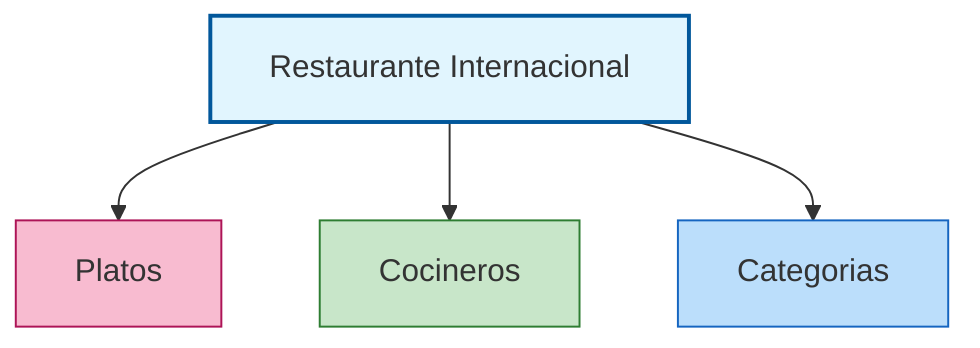
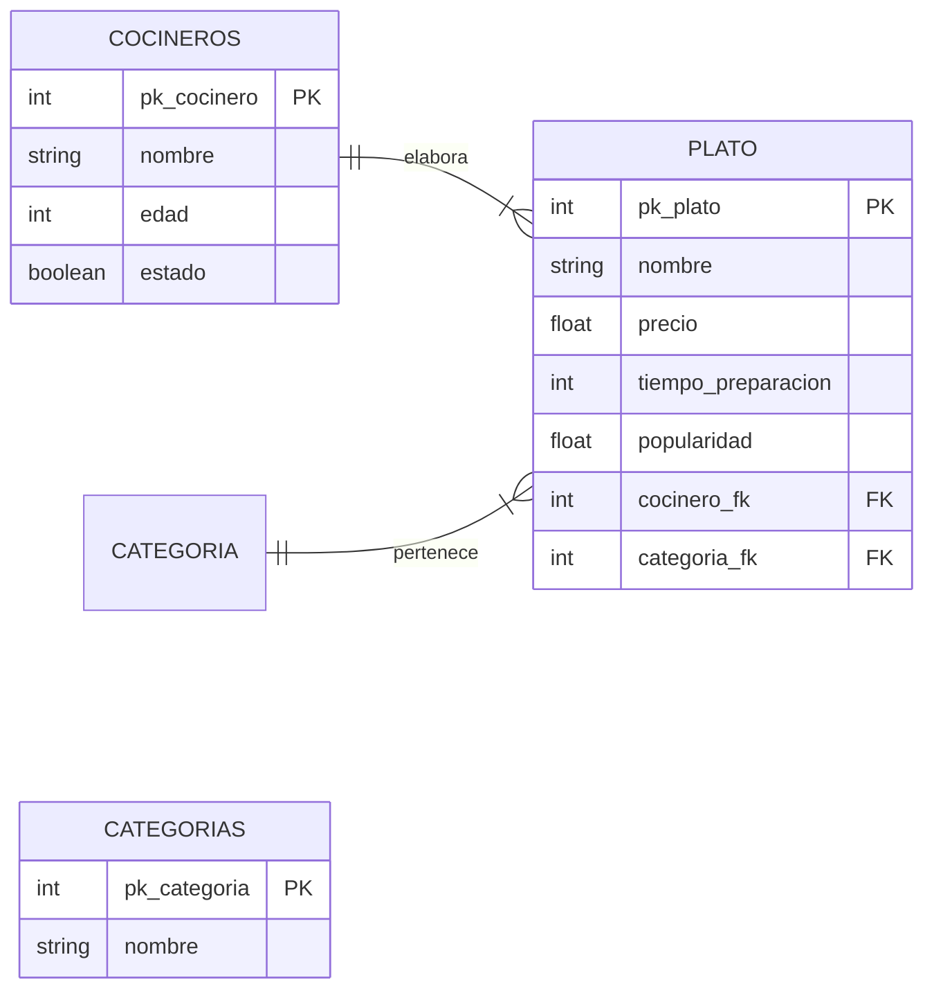

# Actividad: Diseña la base de datos del Restaurante Internacional

***

## 🎯 Objetivo
Desarrollar el diseño de una base de datos relacional para organizar la información de un restaurante internacional, centrándose en la clasificación gastronómica de los platos, la relación con sus cocineros y la aplicación de la normalización.

***

## 1. Análisis inicial

La tabla original mezcla datos de platos, cocineros y el origen gastronómico del plato. Se detectan problemas de duplicidad (repetición de categorías y cocineros), dependencias incorrectas (por ejemplo, el origen culinario no depende del cocinero) y dificultad para actualizar información.

| Plato              | Precio (€) | Tiempo Prep. (min) | Popularidad | Cocinero      | Edad | Estado    | Categoría gastronómica |
|--------------------|------------|--------------------|-------------|---------------|------|-----------|-----------------------|
| Pizza Margherita   | 5,00       | 25                 | 4,7         | Luigi         | 42   | Alta      | Italiana              |
| Sushi Maki         | 7,00       | 20                 | 4,5         | Akira         | 35   | Alta      | Japonesa              |
| Paella             | 9,00       | 40                 | 4,8         | Carmen        | 47   | Baja      | Mediterránea          |
| Quiche Lorraine    | 6,50       | 45                 | 3,8         | Pierre        | 55   | Alta      | Francesa              |
| Gazpacho           | 3,50       | 15                 | 4,1         | Carmen        | 47   | Alta      | Mediterránea          |
| Tiramisú           | 4,50       | 35                 | 4,3         | Luigi         | 42   | Alta      | Italiana              |
| Tortilla Española  | 4,00       | 20                 | 4,4         | Carmen        | 47   | Baja      | Mediterránea          |
| Nigiri             | 6,00       | 20                 | 4,2         | Akira         | 35   | Alta      | Japonesa              |
| Lasagna            | 7,00       | 45                 | 4,5         | Luigi         | 42   | Alta      | Italiana              |
| Tempura            | 7,00       | 25                 | 4,0         | Akira         | 35   | Alta      | Japonesa              |
| Moussaka           | 7,50       | 50                 | 4,2         | Carmen        | 47   | Baja      | Griega                |
| Falafel            | 4,00       | 20                 | 4,4         | Samir         | 38   | Alta      | Árabe                 |
| Kimchi             | 5,50       | 50                 | 3,9         | Pierre        | 55   | Alta      | Coreana               |
| Ceviche            | 8,00       | 15                 | 4,4         | Carmen        | 47   | Baja      | Peruana               |
| Crêpe              | 5,00       | 20                 | 4,5         | Pierre        | 55   | Alta      | Francesa              |

***

## 2. Identificación de problemas

- Duplicidad de cocineros y categorías gastronómicas.
- Relación incorrecta entre atributos.
- Actualizaciones difíciles si se mantiene información redundante.

***

## 3. Proceso de normalización

Se separa la información en tres tablas: Platos, Cocineros, Categorías.



***

## 4. Esquema Entidad-Relación (ER)

- PLATO está asociado a un cocinero (1:N) y a una categoría gastronómica (1:N).
- COCINERO puede haber elaborado varios platos.
- Categoría gastronómica (italiana, japonesa, etc.) se asocia a varios platos.

***

## 5. Esquema propuesto



| Entidad                   | Clave primaria | Principales atributos               | Clave foránea                     |
|---------------------------|---------------|-------------------------------------|------------------------------------|
| **COCINEROS**             | pk_cocinero   | nombre, edad, estado                |                                    |
| **CATEGORIAS**            | id_categoria  | nombre (Italiana, Japonesa...)      |                                    |
| **PLATO**                 | id_plato      | nombre, precio, tiempo, popularidad | id_cocinero, id_categoria          |

***

## 6. Creación de las tablas

```sql
CREATE TABLE COCINERO (
    id_cocinero INT PRIMARY KEY AUTO_INCREMENT,
    nombre VARCHAR(50),
    edad INT,
    activo BOOLEAN
);
```

```sql
CREATE TABLE CATEGORIA_GASTRONOMICA (
    id_categoria INT PRIMARY KEY AUTO_INCREMENT,
    nombre VARCHAR(30)
);
```

```sql
CREATE TABLE PLATO (
    id_plato INT PRIMARY KEY AUTO_INCREMENT,
    nombre VARCHAR(50),
    precio FLOAT,
    tiempo_preparacion INT,
    popularidad FLOAT,
    id_cocinero INT,
    id_categoria INT,
    FOREIGN KEY (id_cocinero) REFERENCES COCINERO(id_cocinero),
    FOREIGN KEY (id_categoria) REFERENCES CATEGORIA_GASTRONOMICA(id_categoria)
);
```

***

## 7. Introducción de datos

**Tabla: COCINERO**
```sql
INSERT INTO COCINERO (nombre, edad, activo)
VALUES
    ('Luigi', 42, TRUE),
    ('Akira', 35, TRUE),
    ('Carmen', 47, TRUE),
    ('Pierre', 55, TRUE),
    ('Samir', 38, TRUE);
```

**Tabla: CATEGORIA_GASTRONOMICA**
```sql
INSERT INTO CATEGORIA_GASTRONOMICA (nombre)
VALUES
    ('Italiana'),
    ('Japonesa'),
    ('Mediterránea'),
    ('Francesa'),
    ('Griega'),
    ('Árabe'),
    ('Coreana'),
    ('Peruana');
```

**Tabla: PLATO**
```sql
INSERT INTO PLATO (nombre, precio, tiempo_preparacion, popularidad, id_cocinero, id_categoria)
VALUES
    ('Pizza Margherita', 5.00, 25, 4.7, 1, 1),
    ('Sushi Maki', 7.00, 20, 4.5, 2, 2),
    ('Paella', 9.00, 40, 4.8, 3, 3),
    ('Quiche Lorraine', 6.50, 45, 3.8, 4, 4),
    ('Gazpacho', 3.50, 15, 4.1, 3, 3),
    ('Tiramisú', 4.50, 35, 4.3, 1, 1),
    ('Tortilla Española', 4.00, 20, 4.4, 3, 3),
    ('Nigiri', 6.00, 20, 4.2, 2, 2),
    ('Lasagna', 7.00, 45, 4.5, 1, 1),
    ('Tempura', 7.00, 25, 4.0, 2, 2),
    ('Moussaka', 7.50, 50, 4.2, 3, 5),
    ('Falafel', 4.00, 20, 4.4, 5, 6),
    ('Kimchi', 5.50, 50, 3.9, 4, 7),
    ('Ceviche', 8.00, 15, 4.4, 3, 8),
    ('Crêpe', 5.00, 20, 4.5, 4, 4);
```

***

## 8. Consultas

### 8.1. Consultas con una sola tabla

**Consulta 1:** Platos que cuestan más de 7 euros.
```sql
SELECT nombre, precio
FROM PLATO
WHERE precio > 7;
```

**Consulta 2:** Cocineros que tengan 40 años o menos.
```sql
SELECT nombre, edad
FROM COCINERO
WHERE edad <= 40;
```

**Consulta 3:** Categorías gastronómicas cuyo nombre contenga la letra "a".
```sql
SELECT nombre
FROM CATEGORIA_GASTRONOMICA
WHERE nombre LIKE '%a%';
```

### 8.2. Consultas entre dos tablas (LEFT JOIN)

**Consulta 4:** Listado de platos junto al nombre del cocinero responsable.
```sql
SELECT PLATO.nombre AS plato, COCINERO.nombre AS cocinero
FROM PLATO
LEFT JOIN COCINERO ON PLATO.id_cocinero = COCINERO.id_cocinero;
```

**Consulta 5:** Listado de platos junto a su categoría gastronómica.
```sql
SELECT PLATO.nombre AS plato, CATEGORIA_GASTRONOMICA.nombre AS categoria
FROM PLATO
LEFT JOIN CATEGORIA_GASTRONOMICA ON PLATO.id_categoria = CATEGORIA_GASTRONOMICA.id_categoria;
```