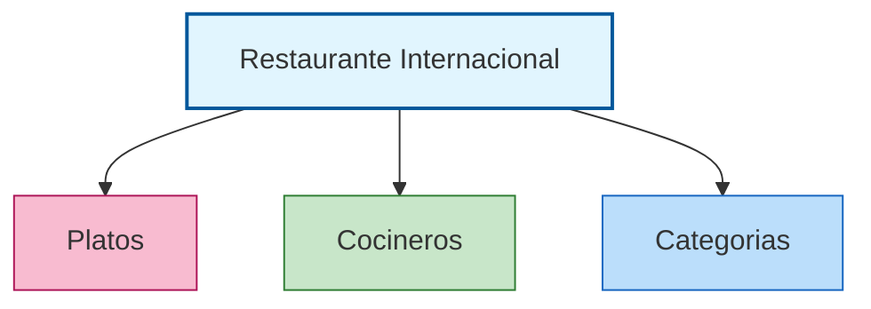
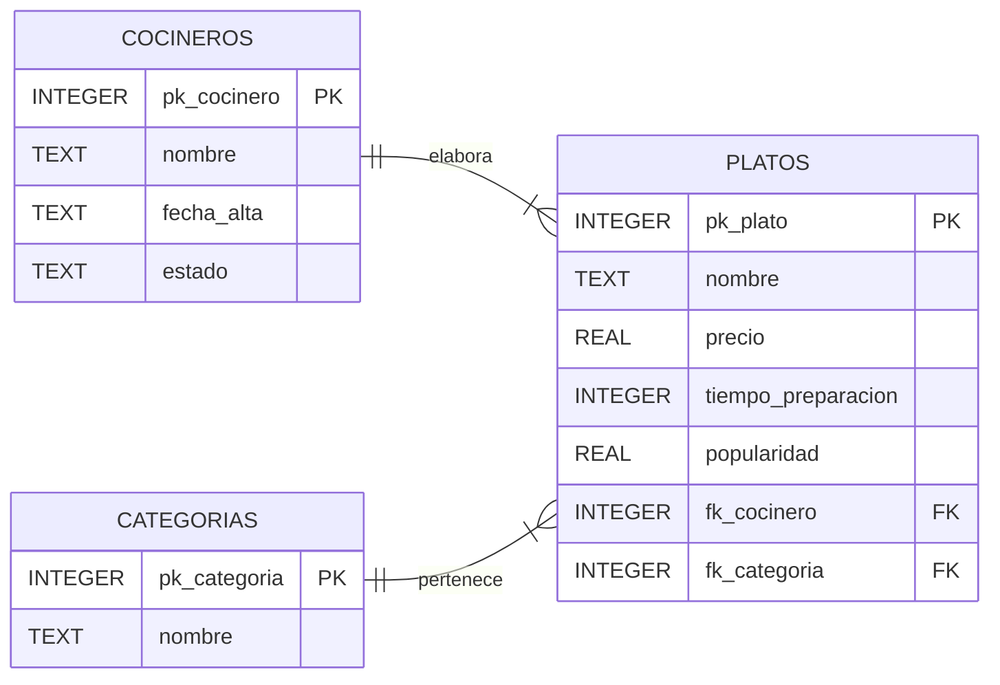

# Actividad: Diseña la base de datos del Restaurante Internacional

***

## 🎯 Objetivo
Desarrollar el diseño de una base de datos relacional para organizar la información de un restaurante internacional, centrándose en la clasificación gastronómica de los platos, la relación con sus cocineros y la aplicación de la normalización. Usaremos **DB Browser for SQLite** para crear, poblar y consultar la base de datos.

> 💻 **Herramienta:** [DB Browser for SQLite](https://sqlitebrowser.org/) — gratuita, sin instalación de servidor, ideal para aprender SQL.

***

## 1. Análisis inicial

La tabla original mezcla datos de platos, cocineros y el origen gastronómico del plato. Se detectan problemas de duplicidad (repetición de categorías y cocineros), dependencias incorrectas (por ejemplo, el origen culinario no depende del cocinero) y dificultad para actualizar información.

| Plato              | Precio (€) | Tiempo Prep. (min) | Popularidad | Cocinero      | Fecha Alta  | Estado    | Categoría gastronómica |
|--------------------|------------|--------------------|-------------|---------------|-------------|-----------|-----------------------|
| Pizza Margherita   | 5,00       | 25                 | 4,7         | Luigi         | 2018-03-15  | Alta      | Italiana              |
| Sushi Maki         | 7,00       | 20                 | 4,5         | Akira         | 2020-09-01  | Alta      | Japonesa              |
| Paella             | 9,00       | 40                 | 4,8         | Carmen        | 2015-06-10  | Baja      | Mediterránea          |
| Quiche Lorraine    | 6,50       | 45                 | 3,8         | Pierre        | 2012-11-22  | Alta      | Francesa              |
| Gazpacho           | 3,50       | 15                 | 4,1         | Carmen        | 2015-06-10  | Alta      | Mediterránea          |
| Tiramisú           | 4,50       | 35                 | 4,3         | Luigi         | 2018-03-15  | Alta      | Italiana              |
| Tortilla Española  | 4,00       | 20                 | 4,4         | Carmen        | 2015-06-10  | Baja      | Mediterránea          |
| Nigiri             | 6,00       | 20                 | 4,2         | Akira         | 2020-09-01  | Alta      | Japonesa              |
| Lasagna            | 7,00       | 45                 | 4,5         | Luigi         | 2018-03-15  | Alta      | Italiana              |
| Tempura            | 7,00       | 25                 | 4,0         | Akira         | 2020-09-01  | Alta      | Japonesa              |
| Moussaka           | 7,50       | 50                 | 4,2         | Carmen        | 2015-06-10  | Baja      | Griega                |
| Falafel            | 4,00       | 20                 | 4,4         | Samir         | 2022-01-08  | Alta      | Árabe                 |
| Kimchi             | 5,50       | 50                 | 3,9         | Pierre        | 2012-11-22  | Alta      | Coreana               |
| Ceviche            | 8,00       | 15                 | 4,4         | Carmen        | 2015-06-10  | Baja      | Peruana               |
| Crêpe              | 5,00       | 20                 | 4,5         | Pierre        | 2012-11-22  | Alta      | Francesa              |

***

## 2. Identificación de problemas

- **Duplicidad de datos:** el nombre del cocinero y su fecha de alta se repiten en varias filas.
- **Dependencia incorrecta:** la categoría gastronómica no depende del cocinero.
- **Anomalías de actualización:** si Luigi cambia su fecha de alta, hay que modificar 3 filas.
- **Anomalías de inserción:** no se puede añadir una categoría nueva sin que tenga platos.

***

## 3. Proceso de normalización

Se separa la información en tres tablas: **PLATOS**, **COCINEROS** y **CATEGORIAS**.



***

## 4. Esquema Entidad-Relación (ER)

- **COCINEROS → PLATOS** (1:N): un cocinero elabora varios platos, pero cada plato tiene un único cocinero.
- **CATEGORIAS → PLATOS** (1:N): una categoría agrupa varios platos, pero cada plato pertenece a una única categoría.



| Entidad        | Clave primaria | Principales atributos               | Clave foránea              |
|----------------|---------------|-------------------------------------|----------------------------|
| **COCINEROS**  | pk_cocinero   | nombre, fecha_alta, estado          |                            |
| **CATEGORIAS** | pk_categoria  | nombre                              |                            |
| **PLATOS**     | pk_plato      | nombre, precio, tiempo, popularidad | fk_cocinero, fk_categoria  |

***

## 5. Crear la base de datos en DB Browser

### Paso 1 — Abrir DB Browser y crear un archivo nuevo

1. Abre **DB Browser for SQLite**.
2. Haz clic en **"Nueva base de datos"**.
3. Guarda el archivo como `restaurante.db` en tu carpeta de trabajo.

### Paso 2 — Abrir la pestaña "Ejecutar SQL"

Haz clic en la pestaña **"Ejecutar SQL"** (parte superior de la ventana). Aquí escribirás y ejecutarás todas las instrucciones SQL.

### Atención. Guardar los cambios

En DB Browser, los cambios no se guardan automáticamente. Haz clic en el botón **"Escribir cambios"** (o Ctrl+S) cada vez que ejecutes instrucciones de modificación.

***

> ⚠️ **Nota SQLite:** SQLite no usa `AUTO_INCREMENT` ni `BOOLEAN`. Usa `INTEGER PRIMARY KEY` (que se autoincrementa automáticamente) y `TEXT` para almacenar textos y fechas. Las fechas se guardan en formato `AAAA-MM-DD`.

***

## 6. Creación de las tablas

Copia y ejecuta cada bloque por separado pulsando el botón **▶ Ejecutar** (o F5).

### Tabla COCINEROS

```sql
CREATE TABLE COCINEROS (
    pk_cocinero INTEGER PRIMARY KEY,
    nombre      TEXT NOT NULL,
    fecha_alta  TEXT,
    estado      TEXT
);
```

### Tabla CATEGORIAS

```sql
CREATE TABLE CATEGORIAS (
    pk_categoria INTEGER PRIMARY KEY,
    nombre       TEXT NOT NULL
);
```

### Tabla PLATOS

```sql
CREATE TABLE PLATOS (
    pk_plato           INTEGER PRIMARY KEY,
    nombre             TEXT NOT NULL,
    precio             REAL,
    tiempo_preparacion INTEGER,
    popularidad        REAL,
    fk_cocinero        INTEGER,
    fk_categoria       INTEGER,
    FOREIGN KEY (fk_cocinero)  REFERENCES COCINEROS(pk_cocinero),
    FOREIGN KEY (fk_categoria) REFERENCES CATEGORIAS(pk_categoria)
);
```

> 💡 Después de ejecutar cada `CREATE TABLE`, ve a la pestaña **"Estructura de la base de datos"** para comprobar que las tablas se han creado correctamente.

***

## 7. Introducción de datos

### Tabla COCINEROS

```sql
INSERT INTO COCINEROS (nombre, fecha_alta, estado) VALUES
    ('Luigi',  '2018-03-15', 'Alta'),
    ('Akira',  '2020-09-01', 'Alta'),
    ('Carmen', '2015-06-10', 'Baja'),
    ('Pierre', '2012-11-22', 'Alta'),
    ('Samir',  '2022-01-08', 'Alta');
```

### Tabla CATEGORIAS

```sql
INSERT INTO CATEGORIAS (nombre) VALUES
    ('Italiana'),
    ('Japonesa'),
    ('Mediterránea'),
    ('Francesa'),
    ('Griega'),
    ('Árabe'),
    ('Coreana'),
    ('Peruana');
```

### Tabla PLATOS

```sql
INSERT INTO PLATOS (nombre, precio, tiempo_preparacion, popularidad, fk_cocinero, fk_categoria) VALUES
    ('Pizza Margherita',  5.00, 25, 4.7, 1, 1),
    ('Sushi Maki',        7.00, 20, 4.5, 2, 2),
    ('Paella',            9.00, 40, 4.8, 3, 3),
    ('Quiche Lorraine',   6.50, 45, 3.8, 4, 4),
    ('Gazpacho',          3.50, 15, 4.1, 3, 3),
    ('Tiramisú',          4.50, 35, 4.3, 1, 1),
    ('Tortilla Española', 4.00, 20, 4.4, 3, 3),
    ('Nigiri',            6.00, 20, 4.2, 2, 2),
    ('Lasagna',           7.00, 45, 4.5, 1, 1),
    ('Tempura',           7.00, 25, 4.0, 2, 2),
    ('Moussaka',          7.50, 50, 4.2, 3, 5),
    ('Falafel',           4.00, 20, 4.4, 5, 6),
    ('Kimchi',            5.50, 50, 3.9, 4, 7),
    ('Ceviche',           8.00, 15, 4.4, 3, 8),
    ('Crêpe',             5.00, 20, 4.5, 4, 4);
```

> 💡 Después de insertar los datos, ve a la pestaña **"Explorar datos"**, selecciona cada tabla y comprueba que los registros son correctos.

> ⚠️ **Importante:** ejecuta siempre los `INSERT` de **COCINEROS** y **CATEGORIAS** antes que los de **PLATOS**, ya que PLATOS referencia a las otras dos tablas. Si el orden es incorrecto, SQLite devolverá un error de integridad referencial.

***

## 8. Consultas

Escribe y ejecuta cada consulta en la pestaña **"Ejecutar SQL"**.

### 8.1. Consultas con una sola tabla

**Consulta 1 — Platos que cuestan más de 7 euros:**
```sql
SELECT nombre, precio
FROM PLATOS
WHERE precio > 7;
```

**Consulta 2 — Cocineros incorporados a partir de 2019:**
```sql
SELECT nombre, fecha_alta
FROM COCINEROS
WHERE fecha_alta >= '2019-01-01';
```

**Consulta 3 — Categorías cuyo nombre contiene la letra "a":**
```sql
SELECT nombre
FROM CATEGORIAS
WHERE nombre LIKE '%a%';
```

### 8.2. Consultas entre dos tablas (JOIN)

> 💡 En SQLite usamos `JOIN` para combinar datos de varias tablas a través de las claves foráneas. Fíjate cómo la `fk_` de una tabla conecta con la `pk_` de la otra.

**Consulta 4 — Nombre del plato y nombre del cocinero responsable:**
```sql
SELECT PLATOS.nombre AS plato, COCINEROS.nombre AS cocinero
FROM PLATOS
JOIN COCINEROS ON PLATOS.fk_cocinero = COCINEROS.pk_cocinero;
```

**Consulta 5 — Nombre del plato y su categoría gastronómica:**
```sql
SELECT PLATOS.nombre AS plato, CATEGORIAS.nombre AS categoria
FROM PLATOS
JOIN CATEGORIAS ON PLATOS.fk_categoria = CATEGORIAS.pk_categoria;
```

***

## 9. Preguntas para responder

Una vez ejecutadas las consultas, responde a estas preguntas:

1. ¿Cuántos platos cuestan más de 7 euros? ¿Cuáles son?
2. ¿Qué cocineros se incorporaron a partir de 2019?
3. ¿Qué ocurre si intentas insertar un plato con `fk_cocinero = 99`? Pruébalo y explica el resultado.
4. ¿Por qué no necesitamos una tabla intermedia entre PLATOS y COCINEROS, pero sí la necesitaríamos si un plato pudiera tener varios cocineros?
5. Si Carmen se jubila y hay que borrarla de COCINEROS, ¿qué problema podría surgir con los platos que tiene asignados?

***

## 10. Reto adicional (nivel avanzado)

**Consulta 6 — Platos con cocinero Y categoría (tres tablas):**
```sql
SELECT PLATOS.nombre     AS plato,
       COCINEROS.nombre  AS cocinero,
       CATEGORIAS.nombre AS categoria
FROM PLATOS
JOIN COCINEROS  ON PLATOS.fk_cocinero  = COCINEROS.pk_cocinero
JOIN CATEGORIAS ON PLATOS.fk_categoria = CATEGORIAS.pk_categoria;
```

**Consulta 7 — ¿Cuántos platos elabora cada cocinero?**
```sql
SELECT COCINEROS.nombre AS cocinero, COUNT(PLATOS.pk_plato) AS num_platos
FROM COCINEROS
JOIN PLATOS ON COCINEROS.pk_cocinero = PLATOS.fk_cocinero
GROUP BY COCINEROS.nombre;
```

**Consulta 8 — Plato más caro de cada categoría:**
```sql
SELECT CATEGORIAS.nombre AS categoria, MAX(PLATOS.precio) AS precio_maximo
FROM PLATOS
JOIN CATEGORIAS ON PLATOS.fk_categoria = CATEGORIAS.pk_categoria
GROUP BY CATEGORIAS.nombre;
```

***

## 📤 Instrucciones de Entrega

- **Archivo `.db`:** Entrega el fichero `restaurante.db` generado con DB Browser.
- **Capturas de pantalla:** Adjunta capturas de la pestaña "Explorar datos" con las tres tablas rellenas y de la ejecución de al menos 3 consultas.
- **Respuestas:** Contesta las preguntas del apartado 10 en el espacio habilitado en Moodle.
- **Plazo:** Según se indique en Moodle.
- **Puntuación máxima:** **10 puntos**

***

## ✅ Criterios de Evaluación

| Criterio | Puntos |
|----------|--------|
| Tablas creadas correctamente con tipos de datos adecuados | 2 |
| Datos insertados sin errores (orden correcto, FK válidas) | 2 |
| Consultas simples (apartado 9.1) correctas | 2 |
| Consultas con JOIN (apartado 9.2) correctas | 2 |
| Preguntas respondidas con coherencia | 1 |
| Reto adicional (opcional) | +1 |
| **Total** | **10** |

***