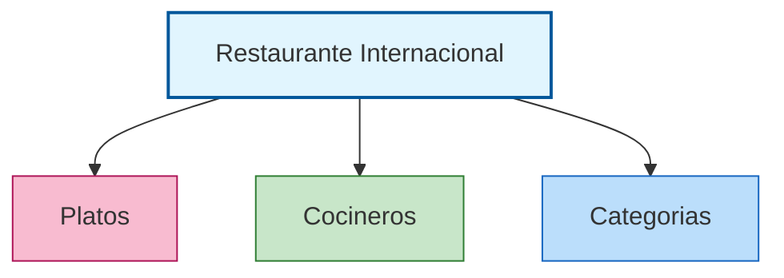
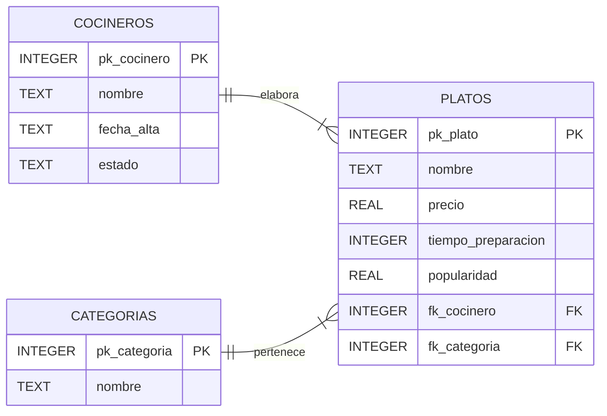

# Actividad: 
## Diseña la base de datos del Restaurante Internacional
### 📝 Versión para completar

> Rellena todos los huecos `______` antes de ejecutar el código en DB Browser. Si el código está incompleto, SQLite devolverá un error.

***

## 🎯 Objetivo
Desarrollar el diseño de una base de datos relacional para organizar la información de un restaurante internacional, centrándose en la clasificación gastronómica de los platos, la relación con sus cocineros y la aplicación de la normalización. Usaremos **DB Browser for SQLite** para crear, poblar y consultar la base de datos.

> 💻 **Herramienta:** [DB Browser for SQLite](https://sqlitebrowser.org/) — gratuita, sin instalación de servidor, ideal para aprender SQL.


## 1. Análisis inicial

La tabla original mezcla datos de platos, cocineros y el origen gastronómico del plato. Identifica los problemas y completa el apartado 2 antes de continuar.

| Plato              | Precio (€) | Tiempo Prep. (min) | Popularidad | Cocinero      | Fecha Alta  | Estado    | Categoría gastronómica |
|--------------------|------------|--------------------|-------------|---------------|-------------|-----------|-----------------------|
| Pizza Margherita   | 5,00       | 25                 | 4,7         | Luigi         | 2018-03-15  | Alta      | Italiana              |
| Sushi Maki         | 7,00       | 20                 | 4,5         | Akira         | 2020-09-01  | Alta      | Japonesa              |
| Paella             | 9,00       | 40                 | 4,8         | Carmen        | 2015-06-10  | Baja      | Mediterránea          |
| Quiche Lorraine    | 6,50       | 45                 | 3,8         | Pierre        | 2012-11-22  | Alta      | Francesa              |
| Gazpacho           | 3,50       | 15                 | 4,1         | Carmen        | 2015-06-10  | Alta      | Mediterránea          |
| Tiramisú           | 4,50       | 35                 | 4,3         | Luigi         | 2018-03-15  | Alta      | Italiana              |
| Tortilla Española  | 4,00       | 20                 | 4,4         | Carmen        | 2015-06-10  | Baja      | Mediterránea          |
| Nigiri             | 6,00       | 20                 | 4,2         | Akira         | 2020-09-01  | Alta      | Japonesa              |
| Lasagna            | 7,00       | 45                 | 4,5         | Luigi         | 2018-03-15  | Alta      | Italiana              |
| Tempura            | 7,00       | 25                 | 4,0         | Akira         | 2020-09-01  | Alta      | Japonesa              |
| Moussaka           | 7,50       | 50                 | 4,2         | Carmen        | 2015-06-10  | Baja      | Griega                |
| Falafel            | 4,00       | 20                 | 4,4         | Samir         | 2022-01-08  | Alta      | Árabe                 |
| Kimchi             | 5,50       | 50                 | 3,9         | Pierre        | 2012-11-22  | Alta      | Coreana               |
| Ceviche            | 8,00       | 15                 | 4,4         | Carmen        | 2015-06-10  | Baja      | Peruana               |
| Crêpe              | 5,00       | 20                 | 4,5         | Pierre        | 2012-11-22  | Alta      | Francesa              |

***

## 2. Identificación de problemas

Completa cada problema detectado en la tabla original con un ejemplo concreto:

- **Duplicidad de datos:** el campo `______` se repite porque varios platos comparten el mismo cocinero. Por ejemplo, `______` aparece __ veces.
- **Anomalía de actualización:** si Pierre cambia su fecha de alta, habría que modificar __ filas.
- **Anomalía de inserción:** no se puede añadir una `______` nueva sin que tenga al menos un `______` asociado.
- **Anomalía de borrado:** si eliminamos a Samir, perderíamos también la información del plato `______`.

***

## 3. Proceso de normalización

Se separa la información en tres tablas: **PLATOS**, **COCINEROS** y **CATEGORIAS**.




Escribe sus nombres:

1. `______`
2. `______`
3. `______`

***

## 4. Esquema Entidad-Relación (ER)

Completa la descripción de las relaciones:

- Un **cocinero** puede elaborar ______ **platos** → relación **1:__**
- Una **categoría** de platos puede agrupar ______ **platos** → relación **1:__**
- **Cada plato** pertenece a ______ **categoría** y, además, tiene ______ **cocinero**





| Entidad        | Clave primaria | Principales atributos               | Clave foránea              |
|----------------|---------------|-------------------------------------|----------------------------|
| **COCINEROS**  | `______`      | nombre, fecha_alta, estado          |                            |
| **CATEGORIAS** | `______`      | nombre                              |                            |
| **PLATOS**     | `______`      | nombre, precio, tiempo, popularidad | `______` , `______`        |

***

## 5. Crear la base de datos en DB Browser

### Paso 1 — Crear un archivo nuevo

1. Abre **DB Browser for SQLite**.
2. Haz clic en **"Nueva base de datos"**.
3. Guarda el archivo como `restaurante.db` en tu carpeta de trabajo.

### Paso 2 — Abrir la pestaña de SQL

Haz clic en la pestaña **"Ejecutar SQL"** (parte superior de la ventana). Aquí escribirás y ejecutarás todas las instrucciones SQL.

### Atención. Guardar los cambios

En DB Browser, los cambios no se guardan automáticamente. Haz clic en el botón **"Escribir cambios"** (o Ctrl+S) cada vez que ejecutes instrucciones de modificación.

***

> ⚠️ **Nota SQLite:** SQLite no usa `AUTO_INCREMENT` ni `BOOLEAN`. Usa `INTEGER PRIMARY KEY` (que se autoincrementa automáticamente) y `TEXT` para almacenar textos y fechas. Las fechas se guardan en formato `AAAA-MM-DD`.
clic

***

## 6. Creación de las tablas

Completa los huecos y ejecuta cada bloque por separado con **▶ Ejecutar** (F5).

### Tabla COCINEROS

```sql
______ TABLE COCINEROS (
    pk_cocinero ______  PRIMARY KEY,
    nombre      ______  NOT NULL,
    fecha_alta  ______,
    estado      ______
);
```

### Tabla CATEGORIAS

```sql
CREATE ______ CATEGORIAS (
    pk_categoria INTEGER ______  KEY,
    nombre       TEXT    NOT ______
);
```

### Tabla PLATOS

```sql
CREATE TABLE ______ (
    pk_plato           INTEGER PRIMARY KEY,
    nombre             TEXT    NOT NULL,
    precio             ______,
    tiempo_preparacion ______,
    popularidad        REAL,
    fk_cocinero        ______,
    fk_categoria       INTEGER,
    FOREIGN KEY (________)   REFERENCES COCINEROS(pk_cocinero),
    FOREIGN KEY (fk_categoria) REFERENCES ______(______)
);
```

> 💡 Después de ejecutar cada `CREATE TABLE`, ve a la pestaña **"Estructura de la base de datos"** para comprobar que las tablas se han creado correctamente.

!!! warning "Entrega Nº 1"

    Una vez que llegues a este punto, entrega el archivo `restaurante.db` a través del Aula Virtual.

***

## 7. Introducción de datos

> ⚠️ **Importante:** ¿en qué orden debes ejecutar los `INSERT`? Marca el orden correcto:
>
> - [ ] Primero PLATOS, luego COCINEROS y CATEGORIAS
> - [ ] Primero COCINEROS y CATEGORIAS, luego PLATOS
> - [ ] El orden no importa
>
> **¿Por qué?** ______

### Tabla COCINEROS

Completa los valores que faltan consultando la tabla original del apartado 1:

```sql
INSERT INTO COCINEROS (nombre, fecha_alta, estado) VALUES
    ('______',  '2018-03-15', '______'),
    ('Akira',   '______',     'Alta'),
    ('Carmen',  '2015-06-10', '______'),
    ('______',  '2012-11-22', 'Alta'),
    ('Samir',   '______',     'Alta');
```

### Tabla CATEGORIAS

Completa las categorías que faltan:

```sql
INSERT INTO CATEGORIAS (nombre) VALUES
    ('______'),
    ('Japonesa'),
    ('______'),
    ('Francesa'),
    ('______'),
    ('Árabe'),
    ('Coreana'),
    ('______');
```

### Tabla PLATOS

Completa los valores de `fk_cocinero` y `fk_categoria` según las tablas anteriores.  
Recuerda: `fk_cocinero` es el `pk_cocinero` del cocinero correspondiente, y `fk_categoria` es el `pk_categoria` de su categoría.

```sql
INSERT INTO PLATOS (nombre, precio, tiempo_preparacion, popularidad, fk_cocinero, fk_categoria) VALUES
    ('Pizza Margherita',  5.00, 25, 4.7, __, __),   -- Luigi / Italiana
    ('Sushi Maki',        7.00, 20, 4.5, __, __),   -- Akira / Japonesa
    ('Paella',            9.00, 40, 4.8, __, __),   -- Carmen / Mediterránea
    ('Quiche Lorraine',   6.50, 45, 3.8, __, __),   -- Pierre / Francesa
    ('Gazpacho',          3.50, 15, 4.1, __, __),   -- Carmen / Mediterránea
    ('Tiramisú',          4.50, 35, 4.3, __, __),   -- Luigi / Italiana
    ('Tortilla Española', 4.00, 20, 4.4, __, __),   -- Carmen / Mediterránea
    ('Nigiri',            6.00, 20, 4.2, __, __),   -- Akira / Japonesa
    ('Lasagna',           7.00, 45, 4.5, __, __),   -- Luigi / Italiana
    ('Tempura',           7.00, 25, 4.0, __, __),   -- Akira / Japonesa
    ('Moussaka',          7.50, 50, 4.2, __, __),   -- Carmen / Griega
    ('Falafel',           4.00, 20, 4.4, __, __),   -- Samir / Árabe
    ('Kimchi',            5.50, 50, 3.9, __, __),   -- Pierre / Coreana
    ('Ceviche',           8.00, 15, 4.4, __, __),   -- Carmen / Peruana
    ('Crêpe',             5.00, 20, 4.5, __, __);   -- Pierre / Francesa
```

> 💡 Después de insertar los datos, ve a la pestaña **"Explorar datos"**, selecciona cada tabla y comprueba que los registros son correctos.

!!! warning "Entrega Nº 2"

    Una vez que llegues a este punto, entrega el archivo `restaurante.db` a través del Aula Virtual.


***


## 8. Consultas

Completa los huecos y ejecuta cada consulta en la pestaña **"Ejecutar SQL"**.

### 8.1. Consultas con una sola tabla

**Consulta 1 — Platos que cuestan más de 7 euros:**
```sql
______ nombre, precio
______ PLATOS
______ precio > 7;
```

**Consulta 2 — Cocineros incorporados a partir de 2019:**
```sql
SELECT nombre, fecha_alta
FROM ______
WHERE ______ >= '______';
```

**Consulta 3 — Categorías cuyo nombre contiene la letra "a":**
```sql
SELECT ______
FROM CATEGORIAS
WHERE nombre ______ '%a%';
```

!!! warning "Entrega Nº 3"

    Una vez que llegues a este punto, entrega el archivo `restaurante.db` a través del Aula Virtual.


### 8.2. Consultas entre dos tablas (JOIN)
 
> 💡 En SQLite usamos `JOIN` para combinar datos de varias tablas a través de las claves foráneas.
> 💡 La clave para unir tablas: `fk_` de una tabla = `pk_` de la otra.  
> Patrón: `JOIN tabla2 ON tabla1.fk_campo = tabla2.pk_campo`

**Consulta 4 — Nombre del plato y nombre del cocinero responsable:**
```sql
SELECT PLATOS.nombre AS plato, ______.nombre AS cocinero
FROM ______
JOIN COCINEROS ON PLATOS.______ = COCINEROS.______;
```

**Consulta 5 — Nombre del plato y su categoría gastronómica:**
```sql
SELECT PLATOS.nombre AS plato, CATEGORIAS.nombre AS ______
FROM PLATOS
______ CATEGORIAS ON PLATOS.fk_categoria = ______.______;
```

!!! warning "Entrega Nº 4"

    Una vez que llegues a este punto, entrega el archivo `restaurante.db` a través del Aula Virtual.


***

## 9. Preguntas para responder

1. ¿Cuántos platos cuestan más de 7 euros? ¿Cuáles son?  
   → ______

2. ¿Qué cocineros se incorporaron a partir de 2019?  
   → ______

3. ¿Qué ocurre si intentas insertar un plato con `fk_cocinero = 99`? Pruébalo y explica el resultado.  
   → ______

4. ¿Por qué no necesitamos una tabla intermedia entre PLATOS y COCINEROS, pero sí la necesitaríamos si un plato pudiera tener varios cocineros?  
   → ______

5. Si Carmen se jubila y hay que borrarla de COCINEROS, ¿qué problema podría surgir?  
   → ______

***

## 10. Reto adicional (nivel avanzado)

Completa esta consulta que une las **tres tablas** a la vez:

```sql
SELECT PLATOS.nombre     AS ______,
       ______.nombre     AS cocinero,
       CATEGORIAS.______ AS categoria
FROM ______
JOIN ______     ON PLATOS.fk_cocinero  = COCINEROS.______
JOIN CATEGORIAS ON ______.fk_categoria = ______.pk_categoria;
```

Escribe tú mismo una consulta para obtener **cuántos platos elabora cada cocinero**:

```sql
-- Tu consulta aquí:


```

!!! warning "Entrega Nº 5"

    Una vez que llegues a este punto, entrega el archivo `restaurante.db` a través del Aula Virtual.


***

## 📤 Instrucciones de Entrega

- **Archivo `.db`:** Entrega el fichero `restaurante.db` generado con DB Browser.
- **Este documento:** Entrega este archivo con todos los huecos rellenados.
- **Capturas de pantalla:** Adjunta capturas de las tres tablas en "Explorar datos" y de al menos 3 consultas ejecutadas.
- **Plazo:** Según se indique en Moodle.
- **Puntuación máxima:** **10 puntos**

***

## ✅ Criterios de Evaluación

| Criterio | Puntos |
|----------|--------|
| Huecos de `CREATE TABLE` correctos (tipos, PK, FK) | 2 |
| Huecos de `INSERT` correctos (valores y claves foráneas) | 2 |
| Consultas simples completadas correctamente | 2 |
| Consultas con `JOIN` completadas correctamente | 2 |
| Preguntas respondidas con coherencia | 1 |
| Reto adicional (opcional) | +1 |
| **Total** | **10** |

***