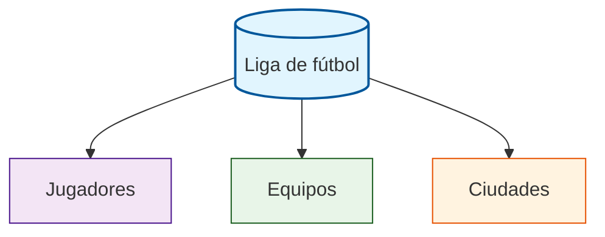
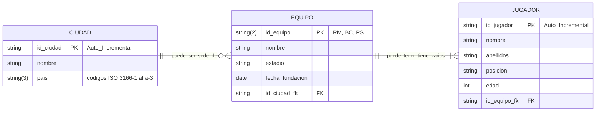

# Actividad: Diseña la base de datos de la Liga de Fútbol

***

## 🎯 Objetivo  
Desarrollar el diseño de una base de datos relacional para organizar la información de la Liga de Fútbol, analizando datos complejos y aplicando técnicas de normalización.

***

## 1. Análisis inicial

Te han dado una tabla que mezcla datos de jugadores, equipos, ciudades y estadios. Al examinarla, detectamos problemas de duplicidad y dependencias incorrectas, lo que dificulta la actualización y el análisis de información.

| Jugador | Equipo | Ciudad | País | Posición | Edad | Año Fundación | Estadio | Capacidad |
|---------|---------|---------|-------|-----------|------|---------------|---------|-----------|
| Karim Benzema | Real Madrid | Madrid | España | Delantero | 36 | 1902 | Santiago Bernabéu | 81.044 |
| Lionel Messi | Inter Miami | Miami | Estados Unidos | Delantero | 36 | 2018 | DRV PNK Stadium | 18.000 |
| Cristiano Ronaldo | Al Nassr | Riad | Arabia Saudita | Delantero | 39 | 1955 | Mrsool Park | 25.000 |
| Kevin De Bruyne | Manchester City | Manchester | Inglaterra | Centrocampista | 32 | 1880 | Etihad Stadium | 53.400 |
| Robert Lewandowski | FC Barcelona | Barcelona | España | Delantero | 35 | 1899 | Spotify Camp Nou | 99.354 |
| Kylian Mbappé | Paris Saint-Germain | París | Francia | Delantero | 24 | 1970 | Parc des Princes | 48.583 |
| Erling Haaland | Manchester City | Manchester | Inglaterra | Delantero | 23 | 1880 | Etihad Stadium | 53.400 |
| Vinicius Junior | Real Madrid | Madrid | España | Extremo | 23 | 1902 | Santiago Bernabéu | 81.044 |
| Harry Kane | Bayern Munich | Múnich | Alemania | Delantero | 30 | 1900 | Allianz Arena | 75.000 |
| Mohamed Salah | Liverpool | Liverpool | Inglaterra | Delantero | 31 | 1892 | Anfield | 53.394 |
| Luka Modrić | Real Madrid | Madrid | España | Centrocampista | 38 | 1902 | Santiago Bernabéu | 81.044 |
| Jude Bellingham | Real Madrid | Madrid | España | Centrocampista | 20 | 1902 | Santiago Bernabéu | 81.044 |
| Rodri | Manchester City | Manchester | Inglaterra | Centrocampista | 27 | 1880 | Etihad Stadium | 53.400 |
| Virgil van Dijk | Liverpool | Liverpool | Inglaterra | Defensa | 32 | 1892 | Anfield | 53.394 |
| Pedri | FC Barcelona | Barcelona | España | Centrocampista | 21 | 1899 | Spotify Camp Nou | 99.354 |
| Manuel Neuer | Bayern Munich | Múnich | Alemania | Portero | 37 | 1900 | Allianz Arena | 75.000 |
| Thibaut Courtois | Real Madrid | Madrid | España | Portero | 31 | 1902 | Santiago Bernabéu | 81.044 |
| Trent Alexander-Arnold | Liverpool | Liverpool | Inglaterra | Defensa | 25 | 1892 | Anfield | 53.394 |
| İlkay Gündoğan | FC Barcelona | Barcelona | España | Centrocampista | 33 | 1899 | Spotify Camp Nou | 99.354 |
| Neymar Jr | Al Hilal | Riad | Arabia Saudita | Delantero | 31 | 1957 | Prince Faisal bin Fahd | 22.500 |


***

## 2. Identificación de problemas

- **Duplicidad**: Aparecen equipos, ciudades y estadios repetidos en las mismas colummas.
- **Dependencias transitivas**: Por ejemplo, el estadio depende del equipo, no del jugador.
- **Actualizaciones complejas**: Cambiar información del estadio implica modificar muchos registros.

***

## 3. Proceso de normalización

Separa la información en tablas según entidades: Jugador, Equipo, Ciudad.




***

## 4. Esquema Entidad-Relación (ER)

Piensa en cómo se relacionan entre sí las tablas:

- **Entidades (tablas):** JUGADOR, EQUIPO, CIUDAD
  
- **Relaciones:**

**1 Equipo - N Jugadores:** 

    - Un equipo puede tener varios jugadores asociados, o bien,
    - Un jugador juega en un solo equipo en cada momento.
  
> Es una relación de uno a muchos (1:N), donde la “llave” está en la tabla JUGADOR (campo id_equipo_fk), que es clave foránea y referencia a la clave primaria de EQUIPO.

En la base de datos, esto se implementa asegurando que cada jugador tenga asociado el identificador de su equipo, pero un equipo puede repetirse muchas veces en la tabla de jugadores.

**1 Ciudad - N Equipos:**
     
  - Una ciudad puede ser sede de uno o varios equipos (o muchos  equipos pueden estar en la misma ciudad).
  - Cada equipo se asocia solo a una ciudad como sede oficial.

> Es otra relación de uno a muchos (1:N), en la que el campo id_ciudad es clave primaria en CIUDAD y clave foránea en EQUIPO.

***
## 5. Esquema propuesto



| Entidad   | Clave primaria | Principales atributos                   | Clave foránea              |
|-----------|---------------|------------------------------------------|----------------------------|
| **CIUDAD**    | id_ciudad     | nombre, país                            |                            |
| **EQUIPO**    | id_equipo     | nombre, estadio, capacidad, año_fundación| id_ciudad (FK de CIUDAD)   |
| **JUGADOR**   | id_jugador    | nombre, posición, edad                   | id_equipo (FK de EQUIPO)   |

---

## 6. Creación de las tablas

```sql
CREATE TABLE CIUDAD (
    id_ciudad INT PRIMARY KEY,
    nombre VARCHAR(50),
    pais VARCHAR(3)
);
```

```sql
CREATE TABLE EQUIPO (
    id_equipo INT PRIMARY KEY,
    nombre VARCHAR(50),
    estadio VARCHAR(50),
    capacidad INT,
    año_fundacion INT,
    id_ciudad INT,
    FOREIGN KEY (id_ciudad_fk) REFERENCES CIUDAD(id_ciudad)
);
```

```sql
CREATE TABLE JUGADOR (
    id_jugador INT PRIMARY KEY,
    nombre VARCHAR(50),
    posicion VARCHAR(30),
    edad INT,
    id_equipo INT,
    FOREIGN KEY (id_equipo_fk) REFERENCES EQUIPO(id_equipo)
);
```
## 7. Introducción de datos

**Tabla: CIUDAD**
Si el campo `id_ciudad` es autoincremental (por ejemplo, definido como `id_ciudad INT AUTO_INCREMENT PRIMARY KEY` en MySQL), no es necesario especificarlo al introducir nuevos datos. El valor se asignará automáticamente (1,2,3,4,5,6...).

El comando para introducir tres registros sería:

```sql
INSERT INTO CIUDAD (nombre, pais)
VALUES
    ('Madrid', 'ESP'),
    ('Manchester', 'GBR'),
    ('Múnich', 'DEU');
```

La base de datos se encargará de asignar automáticamente los identificadores únicos para cada ciudad insertada. Así se facilita la introducción de registros y se evita duplicar identificadores por error.

**Tabla: EQUIPO**
En ese caso, asignamos manualmente un **campo PRIMARY KEY de dos letras** a cada equipo. Por ejemplo:

```sql
INSERT INTO EQUIPO (id_equipo, nombre, estadio, capacidad, fecha_fundacion, id_ciudad)
VALUES 
    ('RM', 'Real Madrid', 'Santiago Bernabéu', 81044, '1902-03-06', 1),
    ('BM', 'Bayern Munich', 'Allianz Arena', 75000, '1900-02-27', 3),
    ('MC', 'Manchester City', 'Etihad Stadium', 53400, '1880-04-16', 2),
    ;
```

Así `id_equipo` será un campo tipo `CHAR(2)` o `VARCHAR(2)`, y cada equipo tiene un identificador único y personalizable para las claves foráneas. Solo debes asegurarte de definir la columna `id_equipo` en la tabla como `CHAR(2)` o similar, y no como numérica.

**Tabla: JUGADOR**
Aquí tienes el ejemplo para insertar cinco jugadores, cada uno vinculado a un equipo mediante la clave foránea `id_equipo`. Recuerda que el identificador de cada jugador debe ser único.

```sql
INSERT INTO JUGADOR (nombre, apellidos, posicion, edad, id_equipo_fk)
VALUES
    ('Karim', 'Benzema', 'Delantero', 36, 'RM'),
    ('Kevin', 'De Bruyne', 'Centrocampista', 32, 'MC'),
    ('Manuel', 'Neuer', 'Portero', 37, 'BM'),
    ('Erling', 'Haaland', 'Delantero', 23, 'MC'),
    ('Luka', 'Modrić', 'Centrocampista', 38, 'RM');
```
Cada jugador queda correctamente relacionado con su equipo (`'RM'`, `'MC'`, `'BM'`) según los ejemplos establecidos.

## 8. Consultas

### 8.1. Consultas que afectan a una sola tabla

**Consulta 1:**
Para mostrar los jugadores mayores de 30 años en la tabla JUGADOR, la consulta SQL sería:

```sql
SELECT nombre, apellidos, edad
FROM JUGADOR
WHERE edad > 30;
```

Esta instrucción muestra el nombre, apellidos y edad de todos los jugadores cuya edad es de 36 años.
```sql
SELECT apellidos, nombre, edad
    FROM JUGADOR
    WHERE edad = 36;
```

Esto es lo que obtendríamos:

| Apellidos | Nombre   | Edad |
|-----------|----------|------|
| Benzema   | Karim    | 36   |
| Messi     | Lionel   | 36   |

**Consulta 2:**
Para obtener los apellidos, nombre y posición de los jugadores cuyo apellido comienza por la letra "M", puedes utilizar la siguiente consulta SQL:

```sql
SELECT apellidos, nombre, posición
    FROM JUGADOR
    WHERE apellidos LIKE 'M%';
```


| Apellidos | Nombre | Posición |
|-----------|--------|------|
| Modrić    | Luka   | Centrocampista   |
| Mbappé    | Kylian | Delantero   |

Estos son los registros que cumplen con la condición establecida.

**Consulta 3:**
Para seleccionar los apellidos yposición de los jugadores que juegan como “Delantero” y tienen menos de 25 años así:

```sql
SELECT apellidos, posicion y edad
    FROM JUGADOR
    WHERE posicion = 'Delantero' AND edad < 25;
```

Según los datos proporcionados, solo el siguiente jugador cumple la condición:

| Apellidos | Posición   |Edad   |
|-----------|----------|------------|
| Mbappé    | Delantero  |24|


**Consulta 4:**
Para calcular la media de edad de los jugadores en la tabla JUGADOR puedes utilizar la función de agregación AVG en SQL:

```sql
SELECT AVG(edad) AS media_edad
FROM JUGADOR;
```

Esta consulta devuelve el promedio de la edad de todos los jugadores registrados en la base de datos, permitiéndote conocer rápidamente cuál es la edad media del grupo.

Por tanto, la consulta devolvería **31.25** como el valor de media_edad.

**Consulta 5:**
Para mostrar los estadios cuya capacidad está entre 10.000 y 30.000 puedes usar la siguiente consulta SQL sobre la tabla EQUIPO:

```sql
SELECT estadio, capacidad
FROM EQUIPO
WHERE capacidad BETWEEN 10000 AND 30000;
```
En la tabla original, los estadios con capacidad entre 10.000 y 30.000 serían:

| Estadio              | Capacidad |
|----------------------|----------|
| DRV PNK Stadium      | 18.000   |
| Mrsool Park          | 25.000   |
| Prince Faisal bin Fahd| 22.500   |


### 8.2. Cnsultas que afectan a dos tablas

**Consulta 1:**

Listado de **todos** los jugadores (tabla:JUGADOR) junto al estadio en el que juegan (tabla: EQUIPO).

```sql
SELECT JUGADOR.apellidos, JUGADOR.nombre, EQUIPO.estadio    -- Selecciona el apellido y nombre de la tabla: JUGADOR , y el estadio de la tabba: EQUIPO
FROM JUGADOR LEFT JOIN EQUIPO   -- Selecciona TODOS los registros de la tabla: JUGADOR y le añade los registros que coinciden con la tabla: EQUIPO   
ON JUGADOR.id_ciudad = EQUIPO.id_equipo  -- Campos que unen las tablas
```

El resultado sería:

| Apellido               | Nombre        | Estadio                   |
|------------------------|--------------|---------------------------|
| Benzema                | Karim        | Santiago Bernabéu         |
| Messi                  | Lionel       | DRV PNK Stadium           |
| Ronaldo                | Cristiano    | Mrsool Park               |
| De Bruyne              | Kevin        | Etihad Stadium            |
| Lewandowski            | Robert       | Spotify Camp Nou          |
| Mbappé                 | Kylian       | Parc des Princes          |
| Haaland                | Erling       | Etihad Stadium            |
| Junior                 | Vinicius     | Santiago Bernabéu         |
| Kane                   | Harry        | Allianz Arena             |
| Salah                  | Mohamed      | Anfield                   |
| Modrić                 | Luka         | Santiago Bernabéu         |
| Bellingham             | Jude         | Santiago Bernabéu         |
| Rodri                  | (Rodri)      | Etihad Stadium            |
| van Dijk               | Virgil       | Anfield                   |
| Pedri                  | (Pedri)      | Spotify Camp Nou          |
| Neuer                  | Manuel       | Allianz Arena             |
| Courtois               | Thibaut      | Santiago Bernabéu         |
| Alexander-Arnold       | Trent        | Anfield                   |
| Gündoğan               | İlkay        | Spotify Camp Nou          |
| Neymar Jr              | Neymar       | Prince Faisal bin Fahd    |

**Consulta 2:**

Listado de **todos** los jugadores (tabla:JUGADOR) junto al estadio en el que juegan (tabla: EQUIPO), **pero el estadio debe tener una capacidad de más de 50 000 espectadores**.

```sql
SELECT JUGADOR.apellidos, JUGADOR.nombre, EQUIPO.estadio
FROM JUGADOR LEFT JOIN EQUIPO
ON JUGADOR.id_ciudad = EQUIPO.id_equipo
WHERE EQUIPO.capacidad > 50000
```

El resultado sería:

Dado el filtro `WHERE EQUIPO.capacidad > 50000`, el resultado serían únicamente los jugadores cuyo estadio tiene capacidad superior a 50.000, siempre que la relación en el JOIN sea correcta.

| Apellidos           | Nombre         | Estadio              |
|---------------------|---------------|----------------------|
| Benzema             | Karim         | Santiago Bernabéu    |
| Haaland             | Erling        | Etihad Stadium       |
| De Bruyne           | Kevin         | Etihad Stadium       |
| Lewandowski         | Robert        | Spotify Camp Nou     |
| Vinicius Junior     | Vinicius      | Santiago Bernabéu    |
| Kane                | Harry         | Allianz Arena        |
| Modrić              | Luka          | Santiago Bernabéu    |
| Bellingham          | Jude          | Santiago Bernabéu    |
| Rodri               | Rodri         | Etihad Stadium       |
| Pedri               | Pedri         | Spotify Camp Nou     |
| Neuer               | Manuel        | Allianz Arena        |
| Courtois            | Thibaut       | Santiago Bernabéu    |
| Alexander-Arnold    | Trent         | Anfield              |
| Gündoğan            | İlkay         | Spotify Camp Nou     |

Solo aparecen estadios de gran capacidad (Bernabéu, Camp Nou, Etihad Stadium, Allianz Arena, y Anfield).