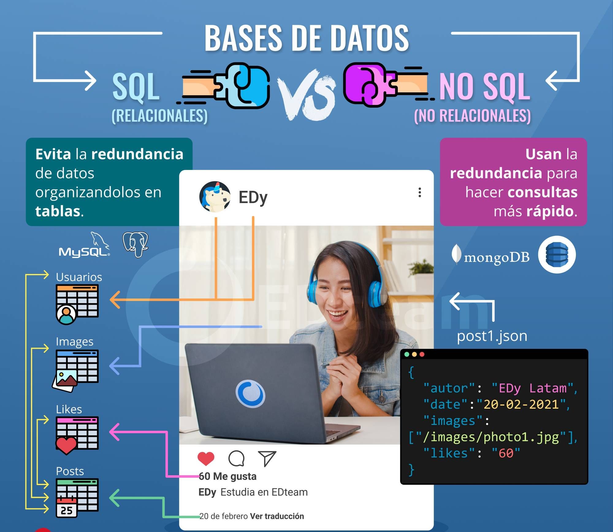

# Elección del tipo de base de datos

¿Cuándo usar SQL y cuando NoSQL?. Llegados a este punto debes tener claras las diferencias entre las bases de datos SQL y las NoSQL. Y si aún tienes dudas, con la siguiente infografía las vas a despejar todas:

{ width="60%" style="display:block; margin:auto;" }

Como ves, las bases de datos SQL separan la información en tablas para asegurarse de la no redundancia y la integridad de los datos. Mientras que las NoSQL no usan tablas y pueden juntar toda la información en un solo lugar para tenerla disponible más rápido.

Pero, ¿Cuál es mejor? ¿Hay que dejar de usar SQL porque las NoSQL son más rápidas?

Ningún tipo de bases de datos es mejor que otra y su uso va a depender de lo que necesites. Es más, según el tamaño de tu aplicación, podrías utilizar bases de datos SQL en ciertas componentes y NoSQL en otros, sin tener problemas. Eso se llama Stack y hablamos mucho más sobre stacks de tecnología y programadores full stack en este video: ¿Qué es un programador Full Stack? ¿Existen o son un mito?

Las bases de datos SQL son excelentes en sistemas que requieran integridad de los datos. Por lo tanto, son usadas en entidades financieras, ecommerce, reservas de hoteles, vuelos, etc.

Las bases de datos NoSQL se usan en escenarios donde la velocidad es más importante que la integridad. Por ejemplo, sistemas de recomendaciones y publicidad, posts y comentarios en redes sociales, etc.

Quizás pienses que con NoSQL tu aplicación irá más rápida, pero salvo que sea muy grande y que los usuarios consulten y creen información muy rápido, no verás la diferencia en el rendimiento. Spoiler: mil usuarios no es muy grande.