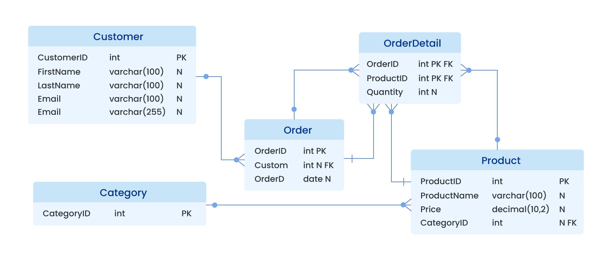

# Bases de datos en TIC II

En TIC II, aprender **bases de datos** te convierte en alguien **capaz de organizar, consultar y analizar grandes cantidades de información** como lo hacen las empresas y científicos. Podrás resolver problemas reales: desde gestionar inventarios, filtrar datos de grandes listas, hasta detectar tendencias o estadísticas usando SQL y otras herramientas digitales.

Además, desarrollarás competencias clave para carreras tecnológicas, científicas o cualquier sector que utilice información, mejorando tu capacidad de razonamiento y automatizando tareas. Dominar bases de datos te facilita investigar, presentar resultados y destacarte tanto en estudios como en el ámbito profesional, preparándote para afrontar retos digitales de la sociedad actual.

{ width="100%" style="display:block; margin:auto;" }

