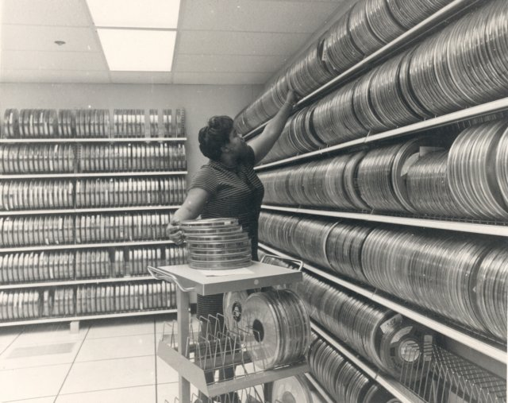
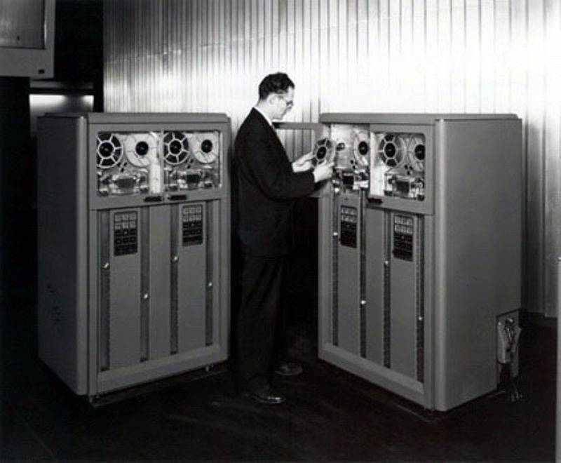

# Introducción a las bases de datos

https://app.ed.team/cursos/mysql

https://sqlninja.ai/

La vida está dominada por los **datos**: tu cumpleaños, tu talla de pantalón, la dirección de tu casa, entre otras cosas. Imagina una vida sin datos. Incluso nuestros antepasados los necesitaban: ¿Cuántos mamuts necesitaban cazar durante el invierno? ¿Qué tipo de lanzas debían fabricar? ¿Qué plantas son venenosas? ¿Cómo protegerse del frío? Sin datos nuestra vida sería imposible de vivir.

Nuestros antepasados guardaban la información en su memoria y la transmitían de boca en boca, de generación en generación. Este método tenía un problema: la información iba transformándose, y **con el tiempo, se creaban los mitos y las leyendas**. A medida que pasaba el tiempo, se inventó la escritura, que evitaba que la información se vaya a distorsionar. La frase “las palabras se las lleva el viento, lo escrito queda” viene del antiguo imperio romano, hace dos mil años. Nuestra cultura e historia está asentada en la escritura.

{ width="40%" style="float: right; margin-left: 1em;" }

Casi dos mil años después, en la década de 1950, se crean las primeras computadoras y, aunque era gigantescas, su función era la misma que las actuales: **procesar y manipular datos**. Guardar esos datos en un soporte que los conserve, es a la tecnología, lo que la escritura al ser humano. Al inicio, se escribía y se leía la información en cintas magnéticas de forma secuencial, un proceso que tardaba mucho tiempo porque, suponiendo que se escribiera el alfabeto, tendrías que pasar por la A, la B, la C hasta llegar a la Z en lugar de ir directamente a ella.

{ width="80%" style="display:block; margin:auto;" }

Es en los **años 70 se creó el primer modelo de bases de datos**, un sistema para almacenar y consultar la información de forma eficiente, que aseguraba la integridad de los datos. Este es el **modelo relacional (o SQL)** y dominaría la tecnología por décadas.

Hacia los años 2000 aparece un nuevo tipo de bases de datos: **las NoSQL** (desde su nombre niegan el concepto SQL). En ese tiempo, la web explota y empresas como Google, Amazon o Facebook necesitan un acceso ultra rápido a su información que no era posible con el modelo SQL.

Mientras las bases de datos** SQL tienen como prioridad la integridad de los datos**, **las NoSQL priorizan el rápido acceso a ellos**, aún a costa de sacrificar la integridad de los datos. Entonces, ¿Qué es mejor? ¿la velocidad? ¿o asegurarnos que los datos sean correctos? Como todo: depende.

!!! note "Bases de datos"

    Las **bases de datos** son un pilar fundamental en el mundo actual, especialmente en ámbitos como el comercio, la administración y muchas otras áreas. Su importancia radica en que permiten **almacenar, organizar y gestionar grandes cantidades de información** de forma segura y eficiente. 

* En el comercio, por ejemplo, facilitan el control de inventarios, las ventas, los clientes y las transacciones, asegurando que los datos estén siempre actualizados y accesibles. 

* En la administración, las bases de datos son vitales para llevar registros precisos de empleados, recursos, finanzas y procesos, lo que mejora la toma de decisiones y la eficiencia organizativa.