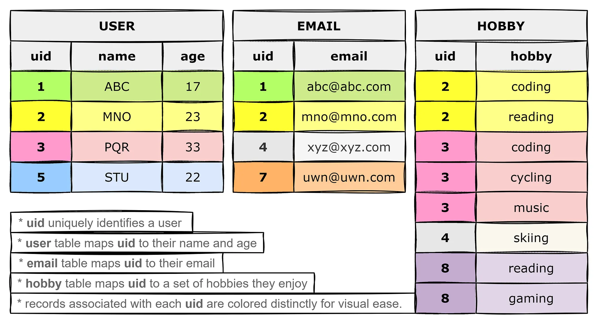
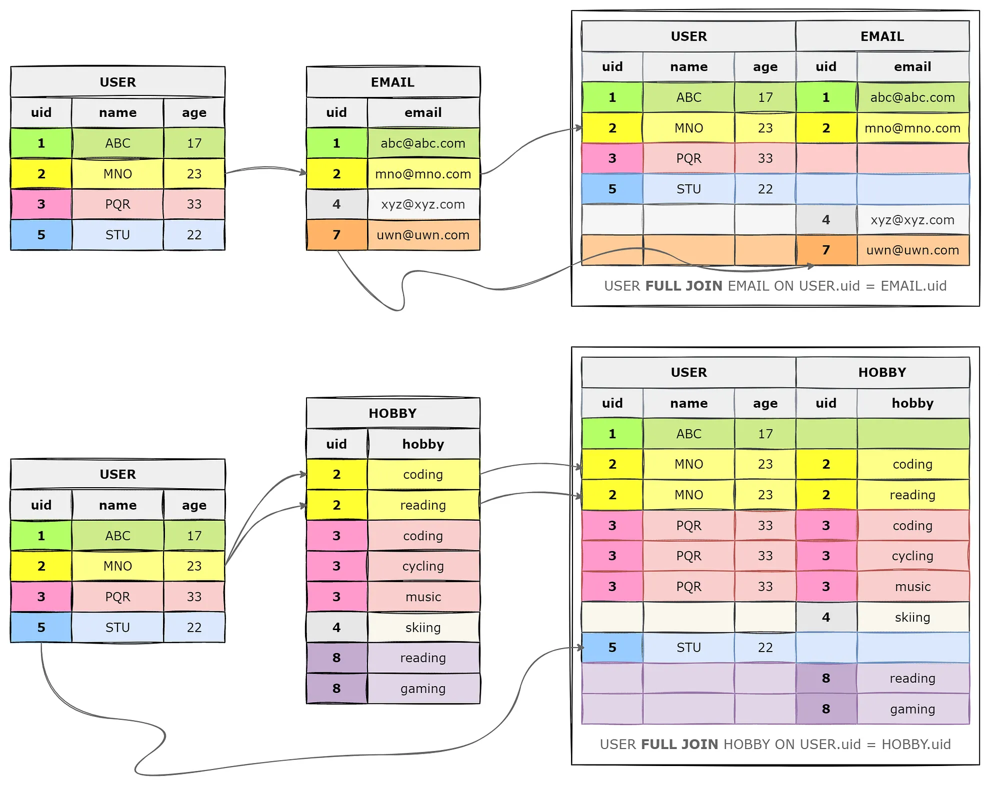
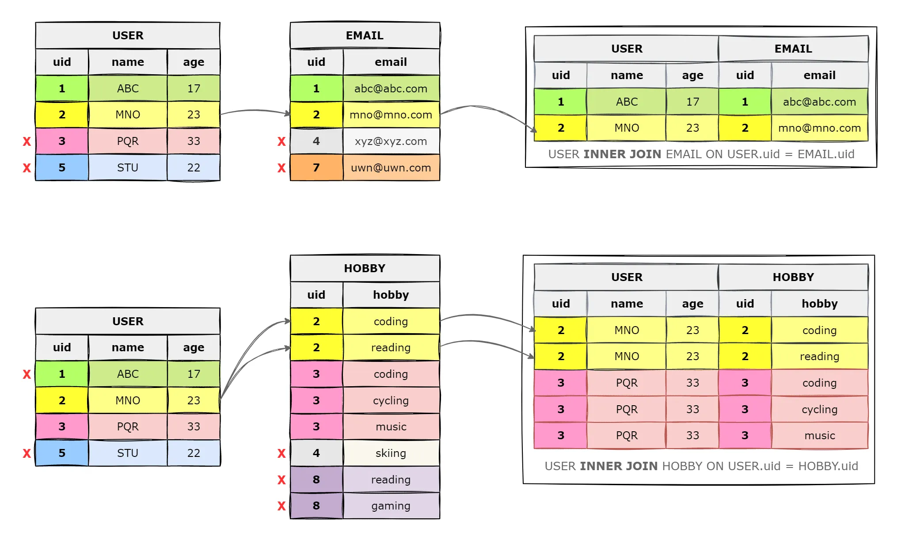
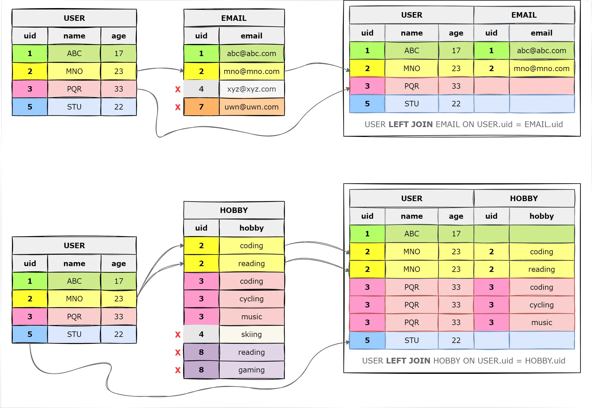
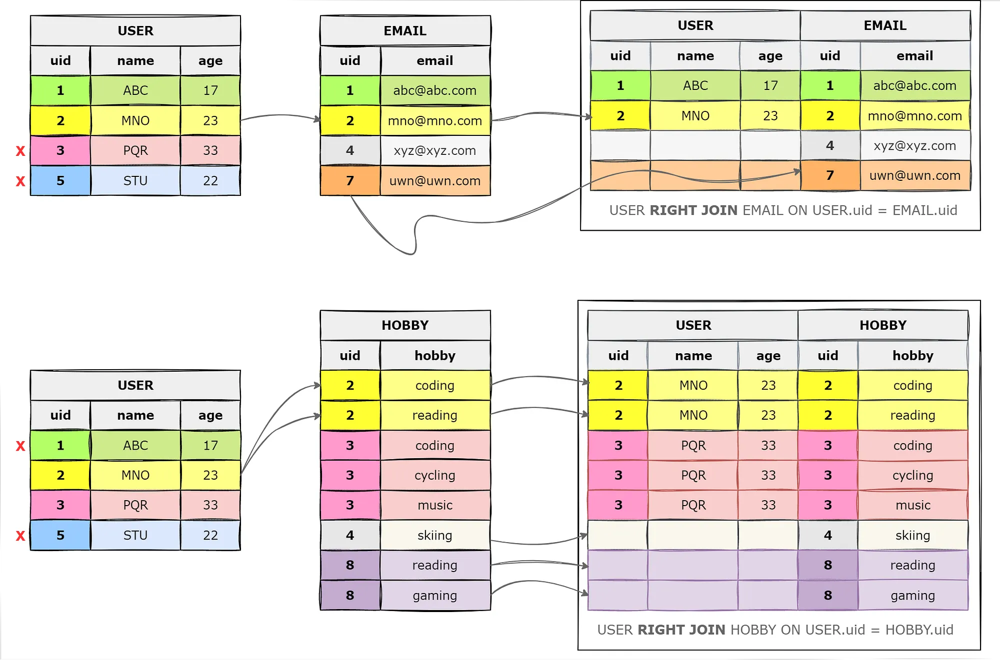

https://medium.com/@shailav.shrestha/reference-types-of-sql-joins-4511cc802f02


# Cláusula `JOIN`

La cláusula `JOIN` en SQL (y, por tanto, en MySQL) se utiliza para **combinar filas de dos o más tablas relacionadas** en función de una condición relacionada entre ellas, normalmente **una clave primaria y una clave foránea**.

Utilizaremos las siguientes tres tablas para ilustrar los tipos de `JOIN`. El contexto de estas tablas no es realmente importante. Aunque son bastante autoexplicativas, analizaremos el USUARIO (USER) llamado MNO:

> El usuario **MNO** tiene **23 años** y su campo PK es **2** (que sirve para relacionarlo con las demás tablas). 
> * Por tanto, podemos obsevar que tiene un email mno@mno.com. 
> * Por último, podemos ver que tiene dos aficiones (HOBBY): **coding** (programar) y **reading** (leer),


{ width="100%" style="display:block; margin:auto;" }


## FULL JOIN

El `FULL JOIN` (también llamado `FULL OUTER JOIN`) se utiliza para combinar registros de dos tablas, devolviendo todos los registros de ambas relaciones, coincidan o no.

```sql
SELECT (campos)
Tabla1 FULL JOIN Tabla2
ON Tabla1.id1 = Tabla2.id2
```

!!!note "FULL JOIN"

    Devuelve:

    * **tabla izquierda:** *todas* las filas.
    * **tabla derecha:** *todas* las filas.

    - Cuando hay coincidencias, se combinan los registros coincidentes.
    - En caso de varias coincidencias, se genera una combinación múltiple (producto cartesiano).
    - Si no hay coincidencia para un registro de una tabla, los campos correspondientes de la otra tabla aparecerán como NULL (vacío).

{ width="100%" style="display:block; margin:auto;" }
 

Ejemplos:

```sql
SELECT *
USER FULL JOIN EMAIL
ON USER.uid = EMAIL.uid
```

```sql
SELECT *
USER FULL JOIN HOBBY
ON USER.uid = HOBBY.uid
```

## INNER JOIN

El `INNER JOIN` se utiliza para combinar registros de dos tablas, devolviendo únicamente aquellas filas donde hay coincidencia en ambas relaciones.

```sql
SELECT (campos)
Tabla1 LEFT JOIN Tabla2
ON Tabla1.id1 = Tabla2.id2
```

!!!note "INNER JOIN"

    Devuelve:

    * **tabla izquierda:** *solo* las filas que tienen coincidencia en la tabla derecha.
    * **tabla derecha:** *solo* las filas que tienen coincidencia en la tabla izquierda.

    - Si existen varias coincidencias para un registro, se genera una combinación múltiple (producto cartesiano).
    - Si un registro no tiene coincidencia en la otra tabla, se descarta y no aparece en el resultado.

{ width="100%" style="display:block; margin:auto;" }

Ejemplos:

```sql
SELECT *
USER INNER JOIN EMAIL
ON USER.uid = EMAIL.uid
```

```sql
SELECT *
USER INNER JOIN HOBBY
ON USER.uid = HOBBY.uid
```


## LEFT JOIN

El `LEFT JOIN`  se utiliza para combinar registros de dos tablas.

```sql
SELECT (campos)
Tabla1 LEFT JOIN Tabla2
ON Tabla1.id1 = Tabla2.id2
```

!!!note "LEFT JOIN"

    Devuelve:

    * **tabla izquierda:** *todas* las filas.
  
    * **tabla derecha:** *solo* las filas coincidentes con la tabla izquierda.
  

      * Si hay coincidencias en la derecha, se genera una combinación múltiple (producto cartesiano).
  
      * Si no hay coincidencia, los campos de la tabla derecha aparecerán como NULL (vacío).


  

```sql
SELECT *
USER LEFT JOIN EMAIL
ON USER.uid = EMAIL.uid
```

```sql
SELECT *
USER LEFT JOIN HOBBY
ON USER.uid = HOBBY.uid
```


## RIGHT JOIN

El `RIGHT JOIN` se utiliza para combinar registros de dos tablas y funciona de manera opuesta al `LEFT JOIN`.

```sql
SELECT (campos)
Tabla1 RIGHT JOIN Tabla2
ON Tabla1.id1 = Tabla2.id2
```

!!!note "RIGHT JOIN"

    Devuelve:

    * **tabla derecha:** *todas* las filas.
    * **tabla izquierda:** *solo* las filas coincidentes con la tabla derecha.

    - Si hay coincidencias en la izquierda, se genera una combinación múltiple (producto cartesiano).
    - Si no hay coincidencia, los campos de la tabla izquierda aparecerán como NULL (vacío).


   


Ejemplos:

```sql
SELECT *
USER RIGHT JOIN EMAIL
ON USER.uid = EMAIL.uid
```

```sql
SELECT *
USER RIGHT JOIN HOBBY
ON USER.uid = HOBBY.uid
```


## JOIN + WHERE

Muy a menudo la cláusula `JOIN` se combina con `WHERE` en SQL para permitir:
1.  (`JOIN`, una de sus cuatro variantes): combinar  registros de dos tablas , y luego,
2.  (`WHERE`): filtrar  esos resultados según una condición específica. 
    

Por ejemplo:

```sql
SELECT *
FROM USER
LEFT JOIN HOBBY
ON USER.uid = HOBBY.uid
WHERE HOBBY.hobby = 'coding'
```

En este caso, solo se muestran los usuarios que tienen como hobbie de tipo 'coding'. El JOIN une ambas tablas y el WHERE filtra el resultado final para mostrar solo los datos que interesan.

|uid  |name   |age   |uid  |hobby |
|-----|-------|------|-----|------|
|  2  |MNO    |23    |2    |*coding*|
|  3  |PQR    |33    |3    |*coding*| 