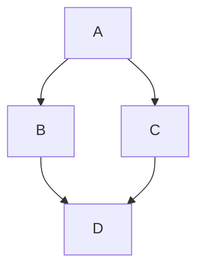
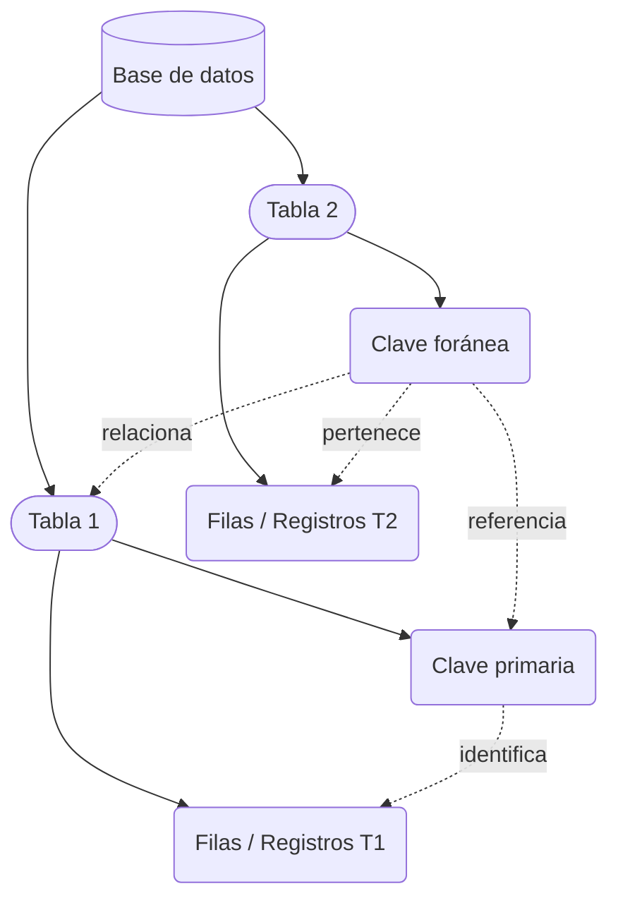

# Introducción a Base de Datos SQL (MySQL)

Las bases de datos relacionales son una herramienta fundamental en la informática moderna. MySQL es uno de los sistemas gestores de bases de datos (SGBD) más utilizados y está basado en el lenguaje SQL (Structured Query Language), el estándar para la gestión de datos relacionales. A continuación, se presentan los conceptos básicos y esenciales que debe conocer un estudiante de 2º de Bachillerato para iniciarse en bases de datos SQL con MySQL.

## Conceptos Básicos

Una **base de datos** es una colección organizada de datos que se almacenan de manera estructurada para facilitar su acceso y manipulación. Un **SGBD** como MySQL permite crear, modificar y consultar bases de datos de forma eficiente.

### Tabla
Es una estructura formada por filas y columnas donde se guardan los datos. Cada tabla debe tener un nombre único en la base de datos.

### Fila y Columna
- **Fila (registro):** Una entrada completa de datos (por ejemplo, los datos de un alumno).
- **Columna (campo):** Representa un atributo o característica de la entidad (por ejemplo, nombre, edad).

### Clave Primaria
Columna o conjunto de columnas que identifican de manera única cada fila de una tabla (por ejemplo, el DNI de una persona).

### Clave Foránea
Columna que relaciona dos tablas distintas, indicando dependencias entre ellas.

flowchart TD
    %% Nodes
        A("fab:fa-youtube Starter Guide")
        B("fab:fa-youtube Make Flowchart")
        n1@{ icon: "fa:gem", pos: "b", h: 24}
        C("fa:fa-book-open Learn More")
        D{"Use the editor"}
        n2(Many shapes)@{ shape: delay}
        E(fa:fa-shapes Visual Editor)
        F("fa:fa-chevron-up Add node in toolbar")
        G("fa:fa-comment-dots AI chat")
        H("fa:fa-arrow-left Open AI in side menu")
        I("fa:fa-code Text")
        J(fa:fa-arrow-left Type Mermaid syntax)

    %% Edge connections between nodes
        A --> B --> C --> n1 & D & n2
        D -- Build and Design --> E --> F
        D -- Use AI --> G --> H
        D -- Mermaid js --> I --> J

    %% Individual node styling. Try the visual editor toolbar for easier styling!
        style E color:#FFFFFF, fill:#AA00FF, stroke:#AA00FF
        style G color:#FFFFFF, stroke:#00C853, fill:#00C853
        style I color:#FFFFFF, stroke:#2962FF, fill:#2962FF

    %% You can add notes with two "%" signs in a row!






## Operaciones Básicas en SQL (DML - Data Manipulation Language)

### Crear una base de datos
```sql
CREATE DATABASE nombre_base_datos;
```
Ejemplo:
```sql
CREATE DATABASE instituto;
```

### Seleccionar una base de datos
```sql
USE instituto;
```

### Crear una tabla
```sql
CREATE TABLE alumnos (
  id INT AUTO_INCREMENT PRIMARY KEY,
  nombre VARCHAR(50),
  edad INT,
  curso VARCHAR(10)
);
```

### Insertar datos en una tabla
```sql
INSERT INTO alumnos (nombre, edad, curso) VALUES ('Ana', 17, '2ºBach');
```

### Consultar datos
```sql
SELECT * FROM alumnos;
```
Esto muestra todos los registros de la tabla alumnos.

### Actualizar datos
```sql
UPDATE alumnos SET edad = 18 WHERE nombre = 'Ana';
```

### Eliminar datos
```sql
DELETE FROM alumnos WHERE nombre = 'Ana';
```

## Tipos de Datos Básicos en MySQL

| Tipo de dato | Descripción                        | Ejemplo         |
|--------------|------------------------------------|-----------------|
| INT          | Número entero                      | 5, -3, 42       |
| VARCHAR(n)   | Cadena de texto de longitud n      | 'Juan', 'TIC'   |
| DATE         | Fecha                              | '2025-10-10'    |
| FLOAT/DOUBLE | Números decimales                  | 3.14, -0.7      |

## Sintaxis común de consultas en SQL

- Seleccionar columnas específicas: 
  ```sql
  SELECT nombre, curso FROM alumnos;
  ```
- Filtrar resultados:
  ```sql
  SELECT * FROM alumnos WHERE curso = '2ºBach';
  ```
- Ordenar resultados:
  ```sql
  SELECT * FROM alumnos ORDER BY edad DESC;
  ```

## Recomendaciones iniciales

- Practica creando tablas y realizando consultas sencillas antes de abordar las relaciones entre tablas.
- Utiliza herramientas gráficas como **phpMyAdmin** o **MySQL Workbench** para gestionar bases de datos de manera visual.
